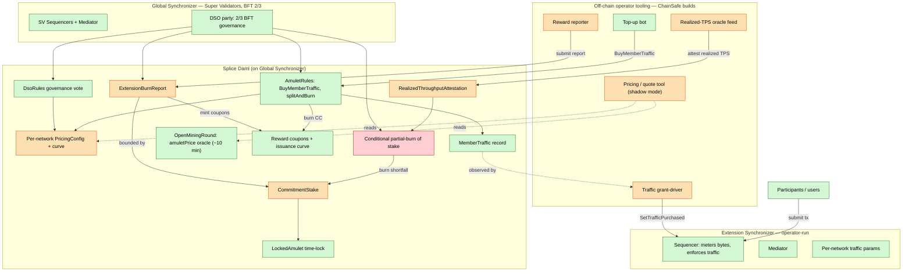
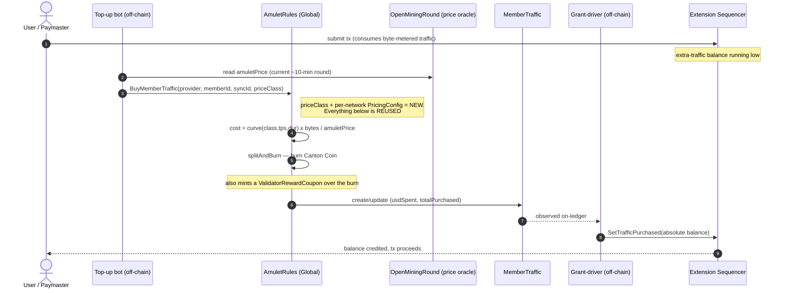
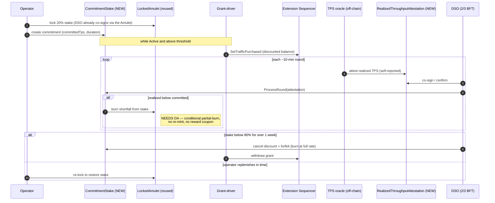
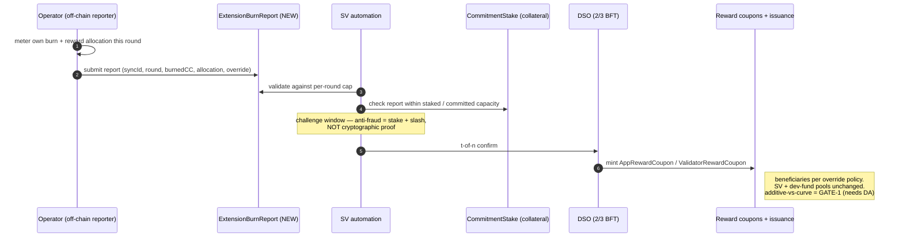
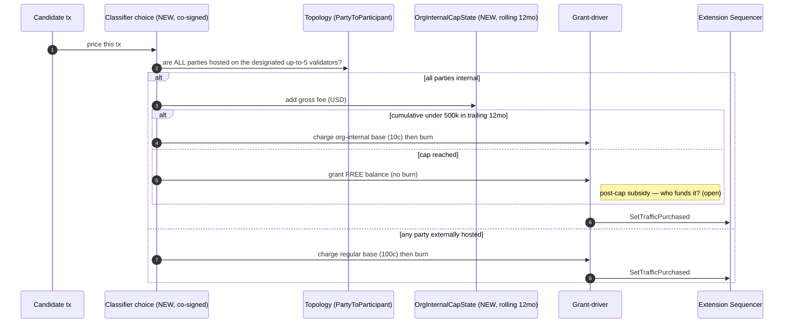

# Extending Mainnet: Tokenomics Alignment — Architecture & Sequence Diagrams

**Companion to:** [Kickoff Proposal](EXTENDING_MAINNET_KICKOFF_PROPOSAL.md) · [Technical Plan](CIP_EXTENDING_MAINNET_TECHNICAL_PLAN.md)
**Date:** 2026-06-30

### Legend (viability coding)
- 🟩 **Reused** — exists today in Splice/Canton, verified against source. Low risk.
- 🟧 **Net-new** — new Daml / off-chain tooling, designable on existing primitives.
- 🟥 **Needs Digital Asset** — a Canton-protocol change or a tokenomics/governance decision that gates the design.

In the architecture diagram these map to green / orange / red fills. In the sequence diagrams they're called out in notes.

---

## 1. High-level architecture

Where each piece lives, and what is reused vs. net-new. Off-chain tooling is what ChainSafe builds; the substantive contracts land upstream in Splice; one primitive needs Digital Asset.

---

## 2. Sequence — Traffic purchase (the core mechanism)

Generalized per-network bandwidth purchase. Only the price-class selection and per-network config are new; the burn → record → grant pipeline is reused as-is.

---

## 3. Sequence — Commitment staking + per-round shortfall burn

Discount is delivered by *granting* subsidized balance (not by re-pricing). The shortfall burn is the piece that needs a Splice Amulet (Daml) change — upstream + DSO-activated.

---

## 4. Sequence — Reward reporting to the DSO, then mint (with override)

Because extension activity is invisible to the validators, the operator self-reports; anti-fraud is stake + slashing, not a proof.

---

## 5. Sequence — Org-internal classification + $500k/12mo cap

Classification must check signed topology and be co-signed, or an operator could mislabel cross-org traffic as internal. *(The current CIP revision adds a third "app-internal" tier — a distinct "within a single application" predicate — not yet drawn here.)*

---

## Notes for reviewers
- Diagrams are deliberately at the *logical* level (contracts + off-chain roles), not node/deployment topology. Say the word if you want a deployment view (participant/sequencer/mediator node layout).
- Every 🟥 item corresponds to a decision in the kickoff "what we need from DA" section: partial-burn (staking), reassignment/denomination (staking), additive-vs-curve (reward minting), and the self-attestation trust model.
- The two 🟥-gated sequences (3 and 4) are drawn as the *intended* design; if a DA go/no-go comes back negative, those flows change materially.
