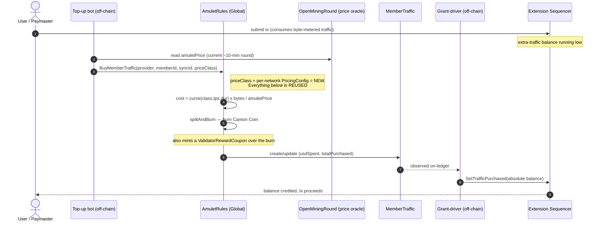
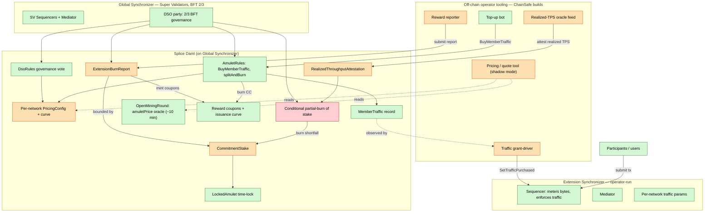
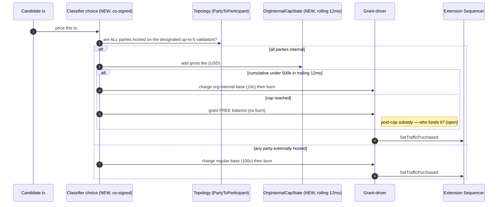
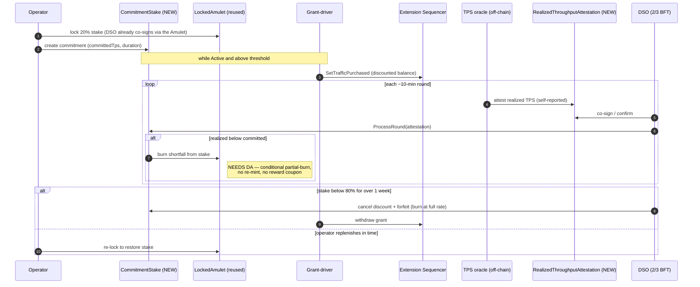
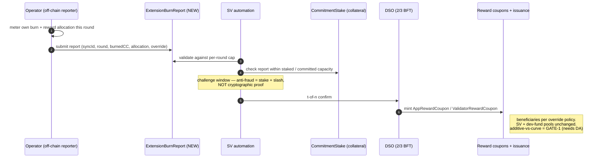

# Extending Mainnet: Tokenomics Alignment — Project Kickoff & Technical Plan

**Status:** Kickoff proposal (for the Digital Asset working session)
**Author:** Sebastian Lindner (ChainSafe)
**Subject CIP:** "Extending Mainnet: Tokenomics Alignment Across the Entire Canton Network" — Shaul Kfir (Digital Asset), Type: Tokenomics, Status: Draft
**Reader profile:** distributed-systems / protocol engineer, *no prior Canton knowledge assumed*
**Date:** 2026-06-30 · **Reconciled 2026-07-02** to the current CIP revision (three base prices; Example 2 corrected; §6.2 units now in years)

---

## How to read this document

 §1 states the project. §2 is a from-first-principles primer on Canton, built on analogies you already know (sequencers, BFT validator sets, gas/fee markets, mint-burn tokens, on-chain governance, staking/slashing). §3 explains the one existing mechanism we are generalizing — *paying for network bandwidth* — which is the core of the whole proposal. §4–§6 are the proposed change and the engineering. §7–§9 are the hard problems and the specific decisions we need to align on with Digital Asset at kickoff.

Throughout, **Canton-specific terms are introduced with a plain-English analogy the first time they appear**, and there's a full translation glossary in the appendix.

---

## 1. What this project is

**One sentence:** take the *single, flat, one-network* mechanism by which Canton charges for bandwidth and recycles those fees as rewards, and turn it into a **per-network, tiered, discountable, commitment-stakeable** mechanism that works across *every* network in Canton — while keeping all the economic value pooled into one token economy.

**Why it matters.** Today, almost all economic alignment in Canton flows through *one* shared network (the "Global Synchronizer"). As the ecosystem scales, more participants will run their *own* networks for throughput and cost reasons. The CIP's goal is that when they do, the fees they generate still flow back into the same token economy and reward pool — so the whole "network of networks" contributes to, and is rewarded by, one unified system instead of fragmenting.

**What we are actually building.** Mostly we are *generalizing and parameterizing machinery that already exists*, plus adding three genuinely new primitives. The bulk of the work lands in Canton's open-source economic layer ("Splice") and, for two specific items, in the Canton protocol itself (owned by Digital Asset). ChainSafe's role is as a network operator and a member of the governing validator set: we can co-design the spec, build the off-chain operator tooling, and pilot it on a test network.

---

## 2. Canton for a protocol engineer (10-minute primer)

Here is the whole mental model, mapped to things you already know.

### 2.1 The actors

| Canton term | What it is | Closest analogy you know |
|---|---|---|
| **Participant node** | A full node that holds *its own slice* of the ledger and executes smart-contract logic locally | A full node, but it only stores the state it's a party to (privacy by default) |
| **Synchronizer** (old name: "domain") | An ordering + commit-coordination service that **cannot read transaction contents** | A shared sequencer / ordering service over *encrypted* blobs |
| **Validator** | A participant node + operator tooling (wallet, automation) | A node operator |
| **Super Validator (SV)** | A validator that *also* helps run the shared network's infrastructure and governs it | A member of a permissioned BFT validator set |
| **Smart contracts** | Written in **Daml**; a contract "template" = a type, a "choice" = a method/entrypoint | Solidity contract + its functions |

ChainSafe is a **Super Validator** — i.e., we hold a seat in the governing set. That's our leverage here.

### 2.2 The synchronizer is a *blind* sequencer

This is the single most important and most un-intuitive thing. A **synchronizer is not a blockchain and does not hold the ledger.** It does two jobs:

1. **Sequencer** — establishes a single total order over messages and multicasts them to their recipients. But the messages are **encrypted**; the sequencer "is a post office handling sealed envelopes it cannot open." It never validates or sees contract data.
2. **Mediator** — runs the commit step of a two-phase-commit: it collects the involved parties' confirmations and announces "committed / rejected," again **without seeing the contents.**

The actual ledger lives on the **participant nodes**, which validate locally and store only the contracts their parties are involved in. So "consensus" in Canton is: *participants validate privately → sequencer orders the encrypted result → mediator finalizes.* Privacy is the default, enforced cryptographically, per network.

### 2.3 The Global Synchronizer is *one* network among many

The **Global Synchronizer** is one specific synchronizer instance, run jointly by the Super Validators under **BFT consensus (2/3 majority, 2f+1)**. Think of it as the canonical, shared, decentralized ordering layer everyone can opt into.

Crucially, **anyone can run their own synchronizer** from the open-source code — a single company (centralized) or a consortium (its own BFT set). These are the "**extension synchronizers**" the CIP is about: independent networks that still interoperate with the Global Synchronizer. An operator running its own synchronizer **fully controls that network's fee parameters** — which is why the CIP can offer throughput discounts on extension synchronizers but not on the Global one (no single party controls the Global one's price).

### 2.4 "Network of networks" = atomic cross-network settlement

Composability does **not** come from a shared chain. It comes from two features:

- A participant can connect to **many synchronizers at once.**
- A contract can be **reassigned** from one synchronizer to another (atomic "move authority to network B"), as long as all its stakeholders are on both.

So a buyer on network A and a seller on network B can do an atomic delivery-vs-payment by reassigning contracts to a common network. (Think native, atomic cross-rollup settlement — no bridge.) **One caveat we must verify with DA:** in the docs we reviewed, multi-network connectivity + reassignment was still behind an alpha feature flag, and the native token may be *pinned* to the Global Synchronizer. If it is, staked CC is already where the validator set can see it (no reassignment needed); the open question is whether that pinning holds and whether cross-network reassignment for composability is generally available. This matters for staking (§7).

### 2.5 The token: Canton Coin, and "Burn-Mint Equilibrium" (BME)

The native token is **Canton Coin** (called **Amulet** in the code). Its economics are a **burn-and-mint** model — close to "EIP-1559 burn + a scheduled issuance/rewards budget":

- **Burn:** all fees are **USD-denominated** and paid by **burning** Canton Coin (removed from supply, *not* paid to an operator). The USD→token conversion uses an on-chain **price oracle that ticks ~every 10 minutes** (one "mining round").
- **Mint:** new Canton Coin is issued on a **fixed schedule** (an "issuance curve," ~2.5B/yr at steady state, capped at 100B over the first decade). Each ~10-minute round mints a budget that is split into **reward pools** — app-operator rewards, validator rewards, Super-Validator rewards, plus a development fund — distributed in proportion to *activity* (you earn "reward coupons" by doing fee-bearing work, then mint against them).

**"Burn-Mint Equilibrium" means: at steady state, total mint ≈ total burn**, so the supply is roughly stable. This is the key to reading the CIP's pricing tables (next).

> **The economics the CIP quotes — and a clarification.** The CIP advertises that a user's "net cost" is ~9.75% of the headline price, because ~90.25% of the burn comes back as rewards. A **footnote** decomposes that 9.75% — **5% development fund + 4.75% Super Validators** (5% + 4.75% = 9.75%) — noting *"these numbers are the stable emissions starting ten years from network launch."* (The footnote is in the CIP Google Doc; it was lost in the plain-text copy in the repo, which is why an earlier read missed it.) This is sound **as a steady-state equilibrium statement** (mint ≈ burn, ~10 years post-launch), and the CIP's design is specifically engineered so that an operator who runs a synchronizer can *capture* that 90.25% for its own activity. Two things to keep straight when we implement: (a) today's reward split is different (heavily weighted to Super Validators and still migrating toward this end state), so the "net cost" is a *future* steady-state figure; and (b) minting is **schedule-driven**, not "re-mint X% of each transaction's burn" — the 90.25% is what equilibrium *produces*, not a per-transaction formula. We must not encode a fixed re-mint ratio.

### 2.6 Governance: an on-chain BFT council ("DSO")

The Super Validators govern collectively as the **DSO** (Decentralized Synchronizer Operations) — a decentralized identity that requires a **2/3 supermajority** to act, hosted across all SV nodes. Economic parameters (all the fees, the issuance split, the bandwidth price) live in a single configuration object and are changed by an **on-chain vote** with **effective-dating** (propose → cast votes → close → activates at a scheduled time). This is a mature, working governance state machine — every *global* parameter this CIP introduces can be added through it.

### 2.7 "Splice" = the open-source economic layer

All of the above — the token, the reward/minting logic, the governance state machine, the bandwidth-purchase flow, the node apps — is implemented in an open-source project called **Splice** (`github.com/canton-network/splice`), on top of the Canton protocol (`github.com/digital-asset/canton`, Digital Asset). Think of Splice as **the reference implementation of the network's economic and governance layer, written as smart contracts (Daml) + node services.** Most of this project's code lands in Splice; a few items touch the Canton protocol itself (DA-owned).

---

## 3. How paying for bandwidth works today (the mechanism we're generalizing)

**This is the heart of the proposal.** Canton already has a complete, working flow for "pay the network for bandwidth, by burning the token." We are mostly generalizing it.

Call the resource **"traffic"** — it's the analog of gas/bandwidth. Here's the end-to-end flow on the Global Synchronizer today:

1. **Metering (in the protocol).** The sequencer charges each node for the messages it sequences, **priced in bytes** (with a multiplier for fan-out to many recipients — like calldata cost scaling with the number of touched parties). Each node has a small free allowance (a refilling burst bucket) and a paid **"extra traffic"** balance. If both are empty, the submission is rejected. *These byte-level parameters are per-network settings* — already independently tunable on any synchronizer.

2. **Purchase + burn (a smart-contract call).** To top up its paid balance, a node calls a choice named **`AmuletRules_BuyMemberTraffic`** on the global rules contract. This **burns** Canton Coin and records the purchase. Two facts make our job much easier:
   - the call **already takes a network ID** (so it already knows *which* synchronizer the traffic is for), and
   - it **already separates the payer from the beneficiary** — i.e. *one party can buy traffic for another.* That's the "paymaster" model (a synchronizer operator subsidizing its users' gas) — already expressible.

3. **Pricing (a governed USD rate).** The price is a single number, **`extraTrafficPrice`, in USD per megabyte**, stored in the global config and changeable only by a 2/3 DSO vote. The token amount burned floats: `tokens_burned = (bytes / 1e6 × USD_per_MB) / oracle_price`. So the **USD price is stable; the token cost floats** with the 10-minute oracle. (There is no separate price oracle to build — this one already exists.)

4. **Granting the balance (a node admin API).** Once the purchase is recorded on-ledger, the sequencer operators push the new balance into their sequencers via an admin call (**`SetTrafficPurchased`**), applied once a BFT threshold agrees. **Important:** this grant step is *mechanically decoupled* from the burn — you can grant a balance without a burn, or burn without granting. (This decoupling is exactly the lever the commitment-discount uses later, and also the thing that makes a single-operator network able to grant itself free bandwidth — see §7.)

5. **Automation.** Node software already auto-tops-up on a cadence (buy ~N seconds' worth of bandwidth whenever the balance runs low). This is the "buy credits every ~10 minutes, never float a huge balance" capital-efficiency story the CIP cites — *it already exists.*

> **Takeaway for kickoff:** "per-network pricing" and "operator-subsidizes-vs-user-pays" do **not** need new sequencer machinery. They need (a) new *pricing state keyed by network*, and (b) a price-class-aware version of the buy call that feeds the **same** burn → record → grant pipeline. That's the cheap 60% of this project.

*The flow, step by step — only the price-class selection and per-network config are new; everything else is the pipeline that exists today:*

---

## 4. What the CIP proposes

### 4.1 A pricing curve instead of one flat price

Replace the single `USD_per_MB` with a **curve** driven by three inputs:

- **Transaction class — three base prices (a "utility discount").** A "regular" cross-organization transaction (e.g. a delivery-vs-payment between two firms) pays full price; an "app-internal" transaction (multiple parties within a single application, e.g. a stablecoin transfer) pays less; an "org-internal" transaction (all parties on validators run by the synchronizer's own operator) pays least. *(Illustrative: $1.00 / $0.30 / $0.10.)*
- **Throughput discount.** The more sustained throughput a network commits to, the cheaper each transaction — a 50% cut per 10× throughput. **Available only on extension synchronizers** (to incentivize moving load off the Global Synchronizer and adding capacity).
- **Duration discount.** Commit (and stake) for longer, pay less — 50% off for a 1-year commitment, deepening for 2- and 3-year commitments.

The combined formula multiplies the base price by both discount factors. **It behaves like a volume + term-commitment enterprise pricing schedule**, expressed as a smooth function.

A worked feel for the numbers (regular base = $1.00):

| Sustained throughput | Headline price/tx | + 1-yr commitment | + 2-yr commitment |
|---|---|---|---|
| 1 tx/s | 100¢ | 50¢ | 37.5¢ |
| 100 tx/s | 25¢ | 12.5¢ | 9.4¢ |
| 1,000 tx/s | 12.5¢ | 6.25¢ | 4.7¢ |
| 10,000 tx/s | 6.25¢ | 3.13¢ | 2.34¢ |

(At steady-state BME the *net* cost is ~9.75% of these, per §2.5.)

> **Diligence note for DA** (we checked the draft's own examples arithmetically): the duration-discount **formula in §6.2 still doesn't reproduce the published table.** The current revision fixed the units (duration now in *years*), but the per-doubling factor is still written as the stated constant where the table needs its *complement* (0.75, not 0.25) — a one-line spec fix. *(The earlier draft's Example 2 mislabel — 2.34¢/0.23¢ tagged as 1-year — has already been corrected to 3.13¢/0.30¢ in this revision, so it's no longer an issue.)* Examples 1, 3, 4 check out.

### 4.2 An org-internal price cap

For internal-only usage (a company onboarding before it opens up to external counterparties), each network can designate **up to 5 "internal" validators**, and once they've paid **$500k in fees over any rolling 12 months**, further internal transactions are **free**. This is the "you shouldn't pay uncapped fees just to use Canton as internal infrastructure" carve-out.

### 4.3 Commitment staking

To *lock in* a throughput+duration discount, the operator **stakes 20% of the committed spend.** If actual usage falls short of the committed throughput, the shortfall is **burned from the stake** each round (with no reward credit). Fail to top the stake back up, and the discount is canceled and the stake is forfeited. This is a **bond against a forward commitment** — economically, a take-or-pay contract enforced by slashing.

### 4.4 Reward reporting + distribution override

Because activity on an extension synchronizer is **invisible to the Super Validators** (the privacy model, §2.2), the operator must **report** its burn and reward allocation to the DSO so the rewards can be minted on the Global Synchronizer. The operator can also **override** how its app/validator rewards are distributed (keep them, or pass them to users as cashback — the "paymaster rewards its users" model).

---

## 5. What already exists vs. what's net-new

| CIP feature | Reuses (already built) | Net-new |
|---|---|---|
| Per-network pricing | network-ID-aware buy call; per-network byte params; USD→token oracle | a per-network pricing-config object; the curve function |
| Paymaster / user-pays | payer ≠ beneficiary already supported | a policy flag + operator automation |
| Org-internal cap | fee records (USD spent); topology (who hosts whom) | "same-operator" predicate; rolling-window accumulator; classifier |
| Commitment staking | on-chain time-locks; burn-without-reward path; a prior lock/forfeit pattern to copy | **realized-throughput oracle**; **conditional partial-burn of a locked stake** |
| Reward reporting + override | reward-coupon minting; beneficiary-splitting primitive | a **cross-network report→mint protocol**; anti-fraud bounding |
| Governance of new params | the DSO vote state machine + effective-dating | the new parameters themselves |

**The recurring theme:** three primitives don't exist, and they all run into the *same wall* — **extension-network activity is invisible to the validator set.** They are: a trustworthy **realized-throughput oracle**, a **conditional partial-burn** of staked tokens, and a **cross-network reward-reporting** protocol.

---

## 6. The engineering, in five pieces

*How the pieces fit together — green = reused/verified today, orange = net-new (Splice Daml or off-chain), red = needs a Digital Asset protocol/governance decision:*

1. **Pricing curve + per-network config.** A governed config object *per network* (not on the global contract), a pure function implementing the curve, and the throughput-discount forced to zero on the Global Synchronizer *in code*. The fiddly bit: the curve is priced **per transaction** but the network meters **per byte** — we need a defined conversion (and it's gameable if naïve). *Recommendation: use the discrete/tiered variant of the curve, not the smooth log function — it avoids on-chain rounding drift and is easier to govern.*

2. **Traffic-purchase generalization (the main piece).** A price-class-aware buy call feeding the existing burn → record → grant pipeline; a paymaster policy; operator top-up automation repointed at the right price class and payer. Mostly assembly of existing parts.

3. **Org-internal classification + cap.** A registry of the ≤5 designated validators; a classifier that checks *every* party's host against that set using signed network topology (and **must be co-signed**, since the operator authoring its own topology could otherwise mislabel cross-org traffic as internal); a rolling-window fee accumulator that flips to "free" at $500k.

4. **Commitment staking.** A stake contract wrapping the existing time-lock; a per-round job that burns the throughput shortfall from the stake; a replenish-or-forfeit lifecycle copied from an existing pattern. **Two new primitives required:** the throughput oracle (below) and a *conditional partial burn of locked principal* — which today **does not exist**; it's a Splice Amulet (Daml) change that still needs DA/community + a DSO vote to activate.

5. **Reward reporting + override.** A per-round "burn report" the operator submits to the DSO; validation against caps and the stake; minting of reward coupons with operator-chosen beneficiaries; an explicit **additive-vs-curve** decision about whether this *expands* total issuance or draws from the existing budget.

(The companion technical plan has the full per-component breakdown, effort sizing, and dependency list.)

---

## 7. The hard problems (the interesting engineering)

These are what the kickoff should really be about.

**A. The privacy wall is the ceiling.** Extension-network activity is *cryptographically invisible* to the validator set. So the realized-throughput number (for staking), the burn report (for minting), and the link between "credits granted" and "tokens burned" are all ultimately **self-attested by the operator** on a single-operator network. The three "independent" anti-fraud layers collapse into **one trust assumption**, and the security of the whole scheme reduces to an invariant the CIP doesn't state: **staked collateral ≥ value of fraudulently-mintable rewards.** This isn't a blocker, but it must be made explicit and bounded (stake + slashing + optional multi-SV attestation), not glossed.

**B. Per-transaction pricing vs per-byte metering.** The curve quotes cents/transaction; the network charges bytes (with a fan-out multiplier). A cross-org delivery-vs-payment (the "expensive" class) has high fan-out → high byte cost; a trivial internal transfer is cheap — yet they're priced flat per transaction. Any fixed bytes-per-tx assumption is gameable in both directions. We need a defined, defensible conversion.

**C. The stake is denominated in the token, the price in USD.** A token-price swing can push the stake below its forfeiture threshold and trigger slashing **with zero change in actual usage** — an FX liquidation hazard. Either continuously re-mark the stake or accept forced liquidations.

**D. Governance throughput.** Per-round, per-network reports and shortfall-burns are validator-set transactions (the most expensive kind). At N extension networks × a round every 10 minutes, this is a load vector on the Global Synchronizer — the opposite of the CIP's "offload the Global Synchronizer" goal. Likely needs per-window batching.

---

## 8. What we need from Digital Asset

These are the items only DA / the protocol can answer, and they gate the open-source work:

1. **Can a privileged, condition-gated choice burn *part* of a locked principal** (no re-mint, no reward), to implement the staking shortfall-burn? This is new authorization in the Splice Amulet (Daml) layer — upstream + DSO-activated, not something ChainSafe can ship alone. **Go/no-go for staking as specified.**
2. **Where does staked token live, and is reassignment GA?** If the native token is pinned to the Global Synchronizer, the validator set can already witness/burn an extension operator's stake with no reassignment — confirm that. Separately, cross-network *composability* still needs multi-network reassignment to be generally available (not alpha) in the target Canton version. **Go/no-go for cross-network staking + composability.**
3. **BME semantics:** is report-driven minting **additive** to the issuance curve (expands total issuance — changes the supply cap and equilibrium) or **drawn from** the existing budget? This is a tokenomics decision for DA/GSF, and everything in §4.4 depends on it.
4. **Trust model:** is DA comfortable with **self-attested-bounded-by-stake** for off-Global activity, or do they want a verification path (multi-SV attestation, audit cross-checks)? An earlier approved change deliberately *removed* self-reporting elsewhere — so this is a philosophical reversal worth their explicit buy-in.
5. **Ownership split:** which pieces DA takes upstream (the two protocol items above) vs. which the community/ChainSafe builds in Splice.

---

## 9. Proposed kickoff agenda & phasing

**Decisions to settle at kickoff (in priority order):**
- The two protocol go/no-gos (§8.1, §8.2) — schedule these as short feasibility spikes against the source first; they can sink large parts of the design.
- The BME additive-vs-curve decision (§8.3).
- Smooth vs tiered curve; the per-tx↔per-byte conversion; the precise definition of "org-internal."
- The §6.2 formula fix (units are already corrected; the per-doubling factor still needs it). *(Example 2's mislabel is already fixed in the current revision.)*

**Phasing (each phase gated on the prior):**
- **Phase 0 — Spec & feasibility:** resolve the above; produce a ratified spec + parameter governance-tier list.
- **Phase 1 — Shadow mode:** build per-network pricing config + the curve and run it *off-ledger* (no burn, no grant) against the published table to validate the math. *ChainSafe can build this independently with no upstream dependency.*
- **Phase 2 — One test network:** real bandwidth grants + commitment staking with shortfall-burn on a single operator-run extension synchronizer, with the Global Synchronizer as an untouched control. Exercise replenish + forfeiture.
- **Phase 3 — Reward reporting:** cross-network report→mint + distribution override against a test validator set.
- **Phase 4 — Mainnet:** a DSO governance vote sets the global parameters and pins the Global Synchronizer to "no throughput discount"; onboard the first production extension synchronizer.

**What ChainSafe drives:** the spec co-design, the off-chain operator tooling (the throughput oracle feed, the bandwidth grant-driver, the shadow-mode pricing tool), running the Phase-2 test network, and the SV governance vote. The substantive smart-contract work lands upstream in Splice; the two protocol items are DA's.

---

## 10. Appendix — Canton ↔ protocol-engineer translation

| Canton term | Read it as |
|---|---|
| Synchronizer (domain) | A blind shared sequencer + a commit coordinator; orders encrypted messages, can't read them |
| Global Synchronizer | The canonical, BFT-run (2/3) shared network everyone can join |
| Extension synchronizer | An independently operated network (single-op or consortium) that interoperates with the Global one |
| Participant node | A full node that stores only the state its parties are involved in |
| Validator / Super Validator | Node operator / member of the governing BFT validator set |
| Daml; template; choice | The smart-contract language; a contract type; a contract method/entrypoint |
| Canton Coin / "Amulet" | The native token; burned for fees, minted as rewards |
| Burn-Mint Equilibrium (BME) | EIP-1559-style burn + a scheduled issuance budget; at steady state mint ≈ burn |
| Mining round | A ~10-minute epoch; carries the token price oracle and the issuance budget |
| Reward coupon | An accrued claim on the round's reward pool, earned by fee-bearing activity |
| DSO | The validators' on-chain governance identity; needs a 2/3 supermajority to act |
| Splice | The open-source economic + governance layer (Daml contracts + node apps) on top of Canton |
| Traffic / "extra traffic" | Bandwidth / gas; the metered resource you burn tokens to buy |
| `AmuletRules_BuyMemberTraffic` | The on-chain call that burns tokens to buy bandwidth (already network-aware; already payer ≠ beneficiary) |
| `SetTrafficPurchased` | The node admin call that grants a bandwidth balance (decoupled from the burn) |
| `extraTrafficPrice` | The governed bandwidth price, in USD per MB |
| Reassignment | Atomically moving a contract's authority from one network to another (native cross-network settlement) |
| Topology (`PartyToParticipant`) | The signed record of which node hosts which party (the source of truth for "org-internal") |
