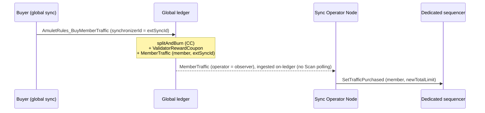

# Design Proposal: Dedicated Synchronizer Traffic Manager

Status: Proposal

This proposal describes how a dedicated synchronizer (a synchronizer stood up
with the Splice software and run by an operator such as a Super Validator) can
participate in the Canton Coin (CC) economy of the global synchronizer. Claims
about current behavior are grounded in Splice 0.6.11 / Canton; code references
point at the `splice/` submodule with `file:line`.

## 1. Summary

Traffic on a dedicated synchronizer is funded by burning CC on the global
synchronizer. Each purchase names the dedicated synchronizer's id and the
participant (`memberId`) whose traffic is being bought, and the burn grants real,
enforced sequencer traffic to that participant on the dedicated synchronizer, per
purchase.

This generalizes the existing global-synchronizer flow. Today a validator burns
CC via `AmuletRules_BuyMemberTraffic`, a `MemberTraffic` record is created, and a
Super Validator reconciles it into the member's sequencer traffic limit. This
proposal applies that same flow to a dedicated synchronizer: the burn happens on
the global synchronizer, and the traffic grant is applied to the dedicated 
synchronizer by its operator, which reconciles it onto the sequencer (its "Sync Operator Node").


## 2. Motivation

There are two motivations, near-term and longer-term.

Near-term, economic alignment. A dedicated synchronizer run by a separate
operator has no economic link to the global CC economy. Transactions on it consume
sequencer traffic, but nothing is burned in CC on the global synchronizer, so the
dedicated synchronizer does not contribute economically to the network. We want
dedicated-synchronizer traffic funded in CC, in the same way global traffic is, so
every dedicated synchronizer is economically aligned with the rest of the Canton
network. This is the no-discount MVP (Workstream 1); it reuses machinery that
largely exists today.

Longer-term, a competitive market for synchronizers. Once traffic across all
synchronizers is funded in CC, differential discount tokenomics (throughput,
commitment length, and transaction class) let synchronizer operators compete on
price and terms to host synchronizers. Operators can offer different rates and
discounts; clients and users choose the synchronizer that best fits their needs
and can move between synchronizers freely as those needs change. The discounts are
the market mechanism, not just a pricing convenience: they let a free market of
operators form around a common, CC-denominated settlement layer. This is the
differential-discounting PoC (Workstream 2), built on top of the MVP.

The analogy is internet service providers. Synchronizers are like ISPs: users of
Canton choose which synchronizer to connect to, operators compete for that
connectivity on price and service, and users can switch providers freely as their
needs change, all while settling in the same underlying currency (CC).

## 3. Background: the traffic model today

Validators burn CC ahead of time to accrue a purchased traffic balance before
they can submit transactions to a sequencer.

- Purchasing is a Daml transaction. The buyer (the `provider`) burns CC from its
  own balance inside the DSO-signed `AmuletRules` contract; the DSO is the
  signatory of `AmuletRules` but does not itself burn the coin. The choice is
  `AmuletRules_BuyMemberTraffic` (`AmuletRules.daml:266-306`, controller =
  provider), which burns CC and creates a `MemberTraffic` contract. The payer
  (`provider`, a party) and the credited participant (`memberId`, a participant
  id) are separate arguments, with nothing tying them together. So one party can
  buy traffic for a participant it does not operate. In the common self-service
  case, the provider is the operator party of that participant.
- Purchased traffic is monotonically increasing. It is preserved across a Logical
  Synchronizer Upgrade (`LsuTransferTrafficTrigger` carries the sequencer traffic
  state to the successor) and is scoped per `migrationId` (a new migration id
  starts fresh).
- The sequencer accumulates consumed traffic (bytes) per member. Consumed traffic
  is not on-ledger; it lives in the sequencer database, but is guaranteed to be 
  consistent between sequencers in a decentralized synchronizer setting such as 
  the global synchronizer (append-only table `seq_traffic_control_consumed_journal`, 
  exposed via the `TrafficConsumed` record with `extraTrafficConsumed`, 
  `baseTrafficRemainder`, and `lastConsumedCost`, `TrafficConsumed.scala:34`).
- Enforcement: a submission is rejected when `availableTraffic < eventCost`, where
  `availableTraffic = (extraTrafficPurchased - extraTrafficConsumed) + baseTrafficRemainder`
  (`TrafficConsumed.scala:168-172`, `TrafficState.scala:32-35`). The base-rate
  remainder is a free allowance that replenishes over time; on the global sync its
  purpose is to avoid a top-up lockout, where a member has too little traffic to
  submit its own buy-traffic transaction. It is a per-synchronizer Canton parameter
  (`maxBaseTrafficAmount`, fed from the Amulet `baseRateTrafficLimits`); the fill
  window is a Splice deployment config (`baseRateBurstWindowMins: 20`), while
  Canton's own default is 10 minutes (`TrafficControlParameters.scala:90`).
- On the SV side, `MergeMemberTrafficContractsTrigger` compacts many
  `MemberTraffic` contracts via `DsoRules_MergeMemberTrafficContracts`, and
  `ReconcileSequencerLimitWithMemberTrafficTrigger` reads `MemberTraffic`, sums
  `getTotalPurchasedMemberTraffic(memberId, synchronizerId)`, and calls the
  sequencer admin API `SetTrafficPurchased` (an absolute new total limit).

Two properties of the current code keep the dedicated-synchronizer case small:

- `AmuletRules_BuyMemberTraffic` is structurally multi-synchronizer aware: it
  accepts any `synchronizerId` in `requiredSynchronizers`
  (`validateBuyMemberTrafficInputs`, `AmuletRules.daml:1710-1716`). Caveat:
  `requiredSynchronizers` holds only the global sync today, and since dedicated
  synchronizers register in a separate template (Section 8) rather than being added
  to it, the choice's gate needs a `splice-amulet` change (Section 7), so this is a
  small change rather than pure reuse.
- `getTotalPurchasedMemberTraffic` is already keyed per `(member, synchronizer,
  migrationId)` (`DbSvDsoStore.scala:1649-1671`), so summing purchases does not
  over-count across synchronizers.

## 4. Proposed design: CC-funded dedicated traffic

1. A buyer (a validator on the dedicated synchronizer, or the Sync Operator (the
   dedicated synchronizer's operator) buying on behalf of its validators)
   burns CC on the global synchronizer via
   `AmuletRules_BuyMemberTraffic`, passing the dedicated synchronizer's id as
   `synchronizerId` and the credited member's (global) participant id as
   `memberId`. memberIds are global participant identities, not
   synchronizer-specific; it is the `synchronizerId` argument that scopes the
   purchase to the dedicated synchronizer (which is why `MemberTraffic` keys on
   both). Each purchase funds a single member; there is no bulk-buy-and-split (the
   payer may differ from that member, Section 3). The choice mints the buyer's
   `ValidatorRewardCoupon` (via
   `splitAndBurn`, `AmuletRules.daml:288`, `2238-2242`) and creates a
   `MemberTraffic` record keyed by `(memberId, synchronizerId, migrationId)`,
   signed by the global DSO.
2. The Sync Operator observes the purchase and applies it on the dedicated
   synchronizer's sequencer: it reads the per-member purchased total for the
   dedicated sync id and calls `SetTrafficPurchased`.
3. The member transacts on the dedicated synchronizer, drawing down its
   dedicated-sequencer traffic. Enforcement is local to the dedicated
   sequencer, using the same `availableTraffic >= eventCost` rule
   as any Canton sequencer. On the dedicated synchronizer the base rate is set to
   zero (no free allowance), so `availableTraffic = extraTrafficPurchased -
   extraTrafficConsumed`. The global sync's base rate exists only to avoid a
   top-up lockout; that does not apply here, because dedicated-sync top-ups are granted
   by the operator through the sequencer admin API (`SetTrafficPurchased`), not
   submitted as a member transaction to the dedicated synchronizer. Initial
   onboarding traffic is likewise granted by the operator rather than drawn from a
   base rate.

The economic link is intrinsic: dedicated traffic is paid for in CC on the global
synchronizer. There is no separate aggregate-consumption reporting step in the
funding path; aggregate reporting is relevant only to the rewards design
(Section 10).

**Out of MVP scope** (revisit post-MVP / Workstream 2):
- Decentralizing the dedicated synchronizer. MVP runs a single sequencer + mediator
  (one operator); BFT (multiple sequencers/mediators, an operator set) is a
  non-trivial addition left out, though the design should not preclude it.
- Per-synchronizer pricing and transaction-class discounts (Section 9, Workstream 2).
- Commitment / staking and draw-down penalties (Workstream 2).
- The operator app-reward model, including any burn-ratio cap (Section 10,
  Workstream 2).
- The elaborate announce -> SV-approve -> coupon -> report purchase handshake
  (Appendix A.D); the MVP uses the direct-burn flow (Section 6).

## 5. Architecture and topology

- For the MVP the dedicated synchronizer is centralized: a single sequencer and
  mediator, run by a single operator (the "Sync Operator"). The operator runs a
  participant connected to both the global and the dedicated synchronizer, plus a
  traffic-management component (the "Sync Operator Node"). Decentralizing it into a
  BFT synchronizer (multiple sequencers/mediators run by an operator set, mirroring
  the global synchronizer's SVs, with each operator reconciling its own sequencer)
  is optional and out of MVP scope; the design does not preclude it, but the MVP
  does not assume it.
- Connecting one participant to multiple synchronizers is a supported
  Canton/Splice capability: LocalNet's `multi-sync` profile cross-connects the
  app-provider and app-user participants to a second synchronizer while they
  remain on the global one (`cluster/compose/localnet/conf/console/app-synchronizer.sc:10`),
  and Canton's integration tests connect a single participant to two synchronizers
  via `connect_local` (`MultiSynchronizerPingIntegrationTests.scala`;
  cross-synchronizer reassignment in
  `multisynchronizer/ReassignmentSubmissionIntegrationTest.scala` requires the same).
- The Sync Operator's participant is onboarded to the global synchronizer as an
  ordinary validator and holds a CC balance there, so it can buy traffic and pay
  fees.

## 6. Purchase-to-grant flow



The MVP has a single operator and sequencer, as shown. If the synchronizer is
later decentralized (BFT, out of MVP scope), each operator would run the same step
against its own sequencer, replicating the grant across sequencers.

Sourcing the purchased total: the purchase record names the registered operator
party as an observer, so the operator's node ingests it on-ledger, event-driven,
with no polling. The observer party comes from the narrow registration mapping
(`syncId -> operator party`, Section 8); the buy choice looks it up and sets it, so
the operator reliably sees every purchase for its sync. Today `MemberTraffic` is
signatory-`dso`-only with no observers (`DecentralizedSynchronizer.daml:57-76`), so
adding the operator observer is the `splice-amulet` change the MVP introduces. The
global Scan API `getMemberTrafficStatus(domain_id = extSyncId, member_id)` returns
`target.total_purchased` (`scan.yaml:280-316`; `HttpScanHandler.scala:2288-2325`)
and remains available for inspection and reconciliation, but the funding path does
not poll it.

## 7. Components: reuse and new work

Reused as-is (no core-package change):
- The burn machinery: `splitAndBurn` (burns CC and mints the `ValidatorRewardCoupon`,
  Section 10) and the `MemberTraffic` record it creates.
- The purchased-total query, already per-(member, synchronizer).
- Scan's `getMemberTrafficStatus` for inspection and reconciliation (not the
  primary sourcing path).

New work:
- Buy-choice gate: `AmuletRules_BuyMemberTraffic` today accepts only
  `synchronizerId in requiredSynchronizers` (`validateBuyMemberTrafficInputs`),
  which is currently just the global sync. Since dedicated synchronizers are
  registered in a separate template (Section 8), not added to
  `requiredSynchronizers`, the choice needs a `splice-amulet` change to accept
  registered synchronizers and to set the registered operator as an observer on
  the `MemberTraffic` it creates (Section 6). The submitter supplies the
  `RegisteredSynchronizer` contract via explicit disclosure so the choice can read
  the operator party.
- Reconcile trigger: generalize `ReconcileSequencerLimitWithMemberTrafficTrigger`
  (today hard-wired to the SV's own local sequencer, guarded to the connected
  domain, skipping SV members) so the Sync Operator runs a variant that (a) targets
  the dedicated sequencer's admin connection, (b) filters to the dedicated sync id,
  (c) sources purchased totals from the operator observer on the traffic record
  (Section 6), and (d) calls `SetTrafficPurchased`. It should not hard-wire a single
  sequencer, so a later BFT synchronizer can run one reconciler per sequencer as on
  the global sync (out of MVP scope).
- Sync-id parse hardening: both traffic triggers parse the sync id with a throwing
  `tryFromString`; make them skip-not-fail. `MergeMemberTrafficContractsTrigger`
  already scopes merges per `(member, synchronizerId)`
  (`MergeMemberTrafficContractsTrigger.scala:56-59`), so this hardening is all it
  needs (no merge rework).
- Register the dedicated synchronizer: the registry template + a new voting
  flow (Section 8). A `splice-dso-governance` change.
- Operational (MVP): Helm charts for a non-global synchronizer and operator docs;
  and LSU management on the dedicated sync by the operator node (its logical
  upgrades need not track the global sync's).
- Per-synchronizer pricing and rewards are optional and deferred (Sections 9, 10;
  Appendix B).

## 8. Registration and governance

A dedicated synchronizer is registered once, by governance, before traffic can be
funded for it. Registration splits into two parts:

- Narrow registration (MVP): a governed `syncId -> operator party` mapping (plus
  lifecycle state). This is the minimum the funding path needs. The buy choice
  reads the operator party from the `RegisteredSynchronizer` contract (attached to
  the purchase transaction via explicit disclosure) and sets it as the observer on
  the traffic record (Section 6), so each operator reliably ingests every purchase
  for its sync, and
  reward attribution has a trusted operator identity. It is a one-time
  per-synchronizer onboarding vote.
- Rate/discount governance (Workstream 2): the governed per-synchronizer rate. Not
  needed for the no-discount MVP (Section 9).

Why a mapping and not just the sync id: a synchronizer id has the form
`name::namespace`, where the namespace is the fingerprint of the operator's (often
decentralized) signing key, so the operator is identifiable from the id. But a
namespace fingerprint is not a usable Daml `Party`, and you need a concrete party
to set as an observer or to credit rewards. The mapping supplies that. It does not
belong in the purchase: a buyer-supplied operator party could be wrong or spoofed,
breaking delivery and rewards.

Mechanics: track a registered synchronizer in a separate template, not by reusing
`requiredSynchronizers`. That field means "the synchronizers Amulet and ANS users
should be connected to" (`DecentralizedSynchronizer.daml:22`) and code likely
relies on that meaning, so overloading it for "synchronizers that support traffic
purchases" is risky. Instead, a separate `RegisteredSynchronizer` template holds
the sync id, operator party, and lifecycle state, updated through its own
governance voting flow rather than by editing an `AmuletConfig` struct field.
Splice already has a governed per-synchronizer map on the DSO side
(`DsoDecentralizedSynchronizerConfig.synchronizers`, lifecycle state only, no
operator party), but every synchronizer there is DSO-operated; the net-new piece is
this operator-party registry. Because governance votes dispatch a closed set of
actions (`ActionRequiringConfirmation`, `DsoRules.daml:68-80`; dispatch
`:1772-1807`), the registry template plus a new voting action (a new `SRARC_`-style
variant and choice) live in the core `splice-dso-governance` package. A submitter
obtains a sync's operator party from Scan and attaches the `RegisteredSynchronizer`
contract to the purchase transaction via explicit disclosure, so the buy choice can
read the operator party (and confirm the sync is registered) without the submitter
being a stakeholder. This is the same disclosed-choice-context pattern Scan already
provides for token-standard choices.

## 9. Pricing

The fee config is a single global `SynchronizerFeesConfig` on
`AmuletDecentralizedSynchronizerConfig.fees` ("same fees across all active
decentralized synchronizers", `DecentralizedSynchronizer.daml:25`), with one
`extraTrafficPrice` in $/MB shared across all `requiredSynchronizers`. The byte to
CC conversion is `computeSynchronizerFees`:

```
trafficCostUsd    = bytes / 1e6 * extraTrafficPrice
trafficCostAmulet = trafficCostUsd / amuletPrice
```

(`AmuletRules.daml:1719-1729`; the round's `trafficPrice` overrides the config
price when set.)

For the no-discount MVP, the dedicated synchronizer uses the existing single
global `extraTrafficPrice`, and the MVP (narrow) registration records no rate.
Per-synchronizer pricing (a governed per-sync rate) is the rate/discount half of
registration (Section 8) and, with the transaction-class discounts, belongs to the
differential-discounting workstream; it would require making `fees`
per-synchronizer (a `splice-amulet` schema change).

## 10. Rewards

- Validator reward: `AmuletRules_BuyMemberTraffic` mints a `ValidatorRewardCoupon`
  on every purchase, regardless of synchronizer id (`splitAndBurn`,
  `AmuletRules.daml:2238-2242`). This is kept, and is consistent with rewarding
  validators on any traffic purchase. `splitAndBurn` always mints this coupon, and
  the extended buy choice keeps `splitAndBurn`, so the dedicated-synchronizer case mints it too.
- App rewards for the operator: a likely model is the operator reporting per
  round on total dedicated traffic, with a reward capped relative to the CC burned
  (a 0.9 x burn cap has been proposed). No burn-ratio cap exists today (issuance
  is a fixed annual amount split by percentages with per-coupon USD caps,
  `Issuance.daml:18-30`), and no per-round total-traffic report exists today. This
  is where aggregate consumption reporting (sourced from the dedicated sequencer via
  `listSequencerTrafficControlState`, summing `extraTrafficConsumed`,
  `SequencerAdminConnection.scala:368`) may be needed. Belongs to the
  differential-discounting workstream.

## 11. Data model

- `MemberTraffic` (`DecentralizedSynchronizer.daml:57-76`) is the purchase record,
  keyed by `(memberId, synchronizerId, migrationId)`. Its reconcile side effect
  (turning a purchase into a sequencer traffic grant) is exactly what we want,
  applied to the dedicated sequencer.
- Visibility: the MVP adds the registered operator as an observer on the traffic
  record (a `splice-amulet` change), so each operator ingests its purchases
  on-ledger without polling; the operator party comes from the registration mapping
  (Section 8). Scan remains for inspection.
- Rewards/reporting contracts for the operator app-reward model are deferred to the
  differential-discounting workstream, not the funding/grant path.

## 12. Trust model

The global side records that CC was actually burned (authoritative, via
`splitAndBurn`) and the purchased amount. The dedicated synchronizer's operator
honors the purchase by granting the corresponding traffic on its sequencer, and
consumption is enforced locally there. For the MVP the operator is a single trusted
party (the synchronizer is centralized). If it is later decentralized (BFT, out of
MVP scope), trust moves to the operator set, exactly as the global synchronizer
trusts its SVs; the design supports that but the MVP does not require it. Because the purchase is CC-funded and the grant is a real sequencer
limit, the funding path has no under-provisioning reconciliation problem.

## 13. Observability (Scan)

- `getMemberTrafficStatus(domain_id, member_id)` returns `actual` (live
  `total_consumed`, `total_limit`) and `target` (`total_purchased`)
  (`scan.yaml:280-316`; `HttpScanHandler.scala:2288-2325`). Its `actual` fields
  read from the sequencer that Scan is attached to, so for a dedicated sync global
  Scan can serve only `target.total_purchased` (from the `MemberTraffic` on the
  global ledger); `total_consumed`/`total_limit` live on the dedicated sequencer,
  which the global DSO does not run and the operator may keep private. So do not
  reuse this endpoint's shape for dedicated syncs.
- Dedicated-synchronizer Scan endpoints (net-new) expose only the global-ledger
  (funding) side and OMIT consumed: list registered synchronizers, per-sync
  purchased/burned totals, and the `RegisteredSynchronizer` mapping / disclosed
  contract a buyer attaches to a purchase. A separate endpoint without a
  `total_consumed` field is cleaner than making that field optional. Standard pattern: register the template in the ACS filter and add endpoints
  (`ScanStore.scala:382`; `scan.yaml`; `HttpScanHandler.scala`). The funding path
  is driven by the on-ledger observer (Section 6), not by polling Scan.
- Consumption visibility is the dedicated-synchronizer operator's choice: it may expose consumed
  traffic (read from its own sequencer, Section 10) or keep it private; it is not
  available from global Scan.

## 14. Open questions

- Operator party representation: the operator is registered (Section 8) and set as
  the traffic-record observer (Section 6); open is whether that operator party is a
  single party or a decentralized party for a BFT synchronizer, and how the
  registry relates to `requiredSynchronizers`.
- Operator lifecycle: how governance offboards or bounds a registered operator-run
  synchronizer (decommission, revoke), mirroring the DSO-side lifecycle states.
- Rewards: the app-reward model for the operator (per-round reporting, the proposed
  0.9 x burn cap), and whether it needs aggregate consumption reporting.

## Appendix A: broader design context

Design context beyond the traffic-funding mechanism above, retained so this
document is self-contained. Items marked (net-new) do not exist in Splice 0.6.11
today; items marked (today) are grounded in current code.

### A. Open questions to specify
- Traffic management on a non-global synchronizer.
- How to burn CC to obtain traffic (the Splice mechanism).
- How much CC buys how much traffic (the Splice conversion).
- Transaction types: the protocol characterizes a transaction and draws traffic
  from the appropriate bucket; Splice configures the protocol with the types and
  rates. (net-new: Canton traffic is byte-based with no tx-class concept today,
  `EventCostCalculator.scala:109-146`.)
- Agreement to purchase traffic.
- Price of traffic.
- Commitment.
- State.

### B. Discount types (proposed)
- Throughput: short-term bulk discount for sustained usage.
- Short duration: a short commitment window (order of one hour), repeated every
  timeslot.
- Governance vote on a fixed discount.

(net-new: all of these discounts are absent today; pricing is a single global
byte-linear `extraTrafficPrice` with no tx-class dimension,
`DecentralizedSynchronizer.daml:36-46`.)

### C. Transaction classes and prices (proposed)
- Composed across multiple apps (different provider parties, or composing across
  synchronizers): non-discounted, $1.00.
- Single app, multiple validators: $0.30.
- Internal to a named list of (max 5) validators: $0.10, capped at $500k/year.


### D. Extended purchase sequence (option)
A fuller purchase sequence, more elaborate than the direct-burn flow in Section 6
and entirely net-new:
1. Provider announces intent to purchase traffic.
2. SVs see it and ask for the burn.
3. Provider burns CC.
4. SVs issue a traffic coupon.
5. Provider tops up traffic on the synchronizer for its validators, split between
   them as it sees fit.
6. Validators transact and draw down their buckets.
7. At end of timeslot, the provider reports actual traffic used and makes the next
   purchase. Open question: what happens if the purchase is not repeated next
   timeslot.

The Section 6 flow is simpler and sufficient for the MVP; the announce/ask/coupon
handshake, provider-driven split, and usage report would only be built if
specifically wanted.

### E. Commitment (proposed)
Staking + tracking + duration + a penalty if the buyer does not draw down enough.
(net-new: no staking or commitment tracking tied to traffic today.)


### F. Splice capabilities (today)
- SV node admin.
- SV Global-Synchronizer governance voting.
- CC app: minting, burning, rewards.
- Canton Name Service (CNS / ANS).
- Connectivity and upgrades.

### G. Node anatomy (today, from the code)
Validator Node = Validator App (Splice) + participant (Canton) (also wallet UI,
ANS/CNS UI). Validator App does: (1) traffic top-ups (`TopupMemberTrafficTrigger`);
(2) global-sync sequencer connection (`ReconcileSequencerConnectionsTrigger`);
(3) reward collection (`ReceiveFaucetCouponTrigger`, wallet
`CollectRewardsAndMergeAmuletsTrigger`).

Super Validator Node = all of the above + SV App + Scan App + Sequencer + Mediator
(bundled `sequencer-mediator`) + BFT (CometBFT or Canton BFT sequencer). SV App
does: governance; reward issuance/processing (the CIP-104 reward computation itself
runs in Scan, `RewardComputationTrigger`); coupon issuance
(`ReceiveSvRewardCouponTrigger`); lifecycle (onboarding/offboarding, LSU); traffic
management (`ReconcileSequencerLimitWithMemberTrafficTrigger`,
`SvOnboardingUnlimitedTrafficTrigger`, `MergeMemberTrafficContractsTrigger`).

Target Dedicated Synchronizer = a stripped-down Global Synchronizer. The MVP is a
single sequencer + mediator (centralized); BFT (multiple sequencers + mediators) is
optional/post-MVP. From the SV side we need: the traffic-management functionality
(extracted); a validator app; a participant; a sequencer + mediator (BFT optional).

## Appendix B: 2026 workstreams (to do)

### Workstream 1: MVP of a no-discount dedicated synchronizer
- [x] Sync-id on the Daml traffic-purchase contract. Already provided by Splice
  0.6.11: `synchronizerId` + `migrationId` are carried end-to-end (`MemberTraffic`
  `DecentralizedSynchronizer.daml:61-62`; `AmuletRules_BuyMemberTraffic` `:272-273`;
  `CO_BuyMemberTraffic` `Install.daml:261-262`; `BuyTrafficRequest:39-40`;
  `ValidatorTopUpState` `TopUpState.daml:21-22`). No work needed.
- [ ] Extract the traffic-management triggers from the SV app into a reusable
  module. Generalize `ReconcileSequencerLimitWithMemberTrafficTrigger` (today
  hard-wired to the SV's own sequencer, guarded to the connected domain) to run per
  operator against its own sequencer, filter by sync id, source purchases from the
  on-ledger observer, and parse the sync id safely (skip-not-fail).
  `MergeMemberTrafficContractsTrigger` already scopes merges per
  `(member, synchronizerId)` (`:56-59`), so it works across syncs; it needs only
  the same safe-parse hardening.
- [ ] Auto-topup (likely MVP): generalize the validator's `TopupMemberTrafficTrigger`
  so a validator connected to both syncs, when low on dedicated traffic, auto-buys
  more via a global-sync burn keyed by the dedicated sync id. Manual-only topups
  are impractical, so this is likely in scope; confirm.
- [ ] Build the Sync Operator Node: the operator runs a participant connected to
  both syncs and reconciles purchased traffic onto the dedicated sequencer. MVP is
  a single sequencer (centralized); BFT (multiple sequencers/mediators) is out of
  MVP scope, but the design should not preclude it. Listens to traffic purchases
  with the correct sync id; tops up traffic on the sequencer; manages logical sync
  upgrades (need not be in step with the global sync's).
- [ ] Verify base rate = 0 is safe on the dedicated sequencer. Preliminary:
  `maxBaseTrafficAmount` is a `NonNegativeLong` (0 is a legal value), `baseRate`
  becomes 0.0 and is never used as a divisor, and base-traffic accrual stays 0, so
  no obvious breakage; confirm end-to-end (onboarding, rate-limiter paths) on a
  running dedicated sync.
- [ ] Deployment: Helm charts for a non-global synchronizer, plus operator docs.
- [ ] Register the dedicated synchronizer: a governed `syncId -> operator party`
  mapping (narrow registration) that binds a non-global operator and drives the
  observer on the traffic record. The governed per-sync rate is separate and
  deferred to Workstream 2.
- [x] Validator rewards on any traffic purchase regardless of sync id. Already the
  behavior: `splitAndBurn` mints a `ValidatorRewardCoupon` on every purchase
  (`AmuletRules.daml:2238-2242`).

### Workstream 2: PoC of differential discounting and rewards
- [ ] Per-transaction-class characterization: teach the protocol to classify a
  transaction and draw from the right bucket/rate (net-new; no tx-class concept in
  Canton traffic today).
- [ ] The three pricing classes and the governance-voted fixed discount
  (Appendices A.B and A.C).
- [ ] Per-synchronizer pricing: make `SynchronizerFeesConfig`/`extraTrafficPrice`
  per-sync rather than a single global value (a `splice-amulet` schema change).
- [ ] Commitment / staking: staking + tracking + duration + a draw-down penalty
  (Appendix A.E).
- [ ] Rewards (all deferred here): the operator app-reward model (per-round
  total-traffic reporting; proposed ~0.9 x burn cap) and the differential
  (per-tx-class) reward model. net-new: no per-round total-traffic report and no
  burn-ratio cap exist today.
