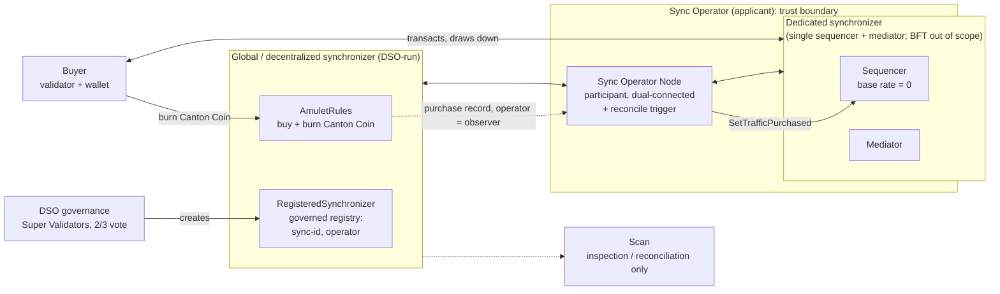
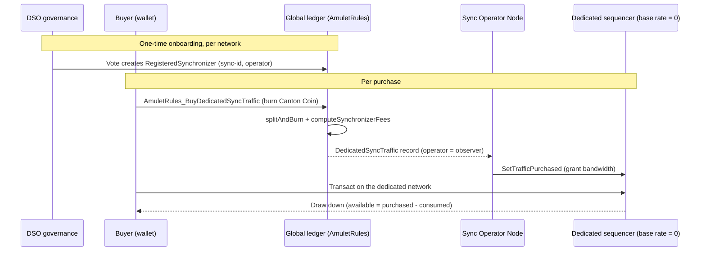

# Proposal: Extending Mainnet - Dedicated-Synchronizer Traffic

## Development Fund Proposal

**Author:** [APPLICANT]
**Status:** Draft
**Created:** 2026-07-23
**Label:** canton-protocol-multi-synchronizer
**Champion:** need Champion

## Abstract

Canton is a "network of networks." There is one shared, decentralized network that everyone can join,
the **Global Synchronizer**, operated jointly by a set of trusted operators called **Super
Validators**. Anyone can also stand up their **own** Canton network from the same open-source
software, for more throughput or lower cost. Today the economics only work on the one shared network:
using it costs money, you burn (permanently destroy) **Canton Coin** to buy **traffic** (the network's
metered bandwidth), and those fees feed Canton Coin's shared reward economy. Activity on any other
network consumes resources but burns nothing, so that value is economically disconnected from Canton
Coin. As more participants run their own networks, which the ecosystem actively wants in order to take
load off the shared network, that value fragments away from the token that is supposed to capture it.

This proposal funds [APPLICANT] to close that gap by implementing a forthcoming Canton Improvement Proposal,
*"Extending Mainnet: Tokenomics Alignment Across the Entire Canton Network"* (to be proposed by
[PROPOSING GROUP]). The mechanism is simple and reuse-first: make traffic on a dedicated, operator-run
synchronizer (also called an "extension" synchronizer) **paid for in Canton Coin**, exactly the way
Global-Synchronizer traffic already is. A
user burns Canton Coin on the shared network, tagged with the dedicated network's identity, and that
network's operator grants the purchased bandwidth on its own infrastructure. Every dedicated network
then contributes to, and is rewarded by, one unified token economy.

The work is delivered as two milestones:

- **Milestone 1, MVP (no-discount):** a working, Canton-Coin-funded traffic manager for dedicated
  synchronizers, end to end. Register a network by governance, buy its traffic by burning Canton Coin,
  and the operator grants it automatically so the buyer can transact. This is the minimal viable
  product that plugs the economic leak, and it reuses machinery that already exists in the network
  software.
- **Milestone 2, PoC (advanced tokenomics):** a proof-of-concept for the CIP's richer model,
  per-network pricing, volume and duration discount curves, commitment staking, and operator rewards.
  This validates the model a competitive marketplace of networks needs. It is exploratory and depends
  on several design decisions that only Digital Asset can finalize.

The rest of this document covers the deployment topology and data flow (with diagrams), the delivery
scope, the specification, the two milestones and their acceptance criteria, an audit policy, funding,
adoption and co-marketing plans, and a long-term sustainment commitment. [APPLICANT] is well placed to
lead this: it is a **Super
Validator** (a member of the network's governing body), a **prospective operator** of a dedicated
synchronizer, and the **technical co-designer** grounding this CIP in the actual Canton source code
alongside [the proposing group].

## Infrastructure Topology

[APPLICANT] delivers the software and templates to stand up a dedicated synchronizer; the running
infrastructure is operated by the operator ([APPLICANT], for the pilot). The two diagrams below separate
what an operator runs (Diagram A) from how a single purchase flows through the system (Diagram B).

### Diagram A: Deployment topology

**Caption.** Inside the "Sync Operator" boundary are the components [APPLICANT] (or any operator) runs:
a **Sync Operator Node** (a participant connected to *both* synchronizers, onboarded to the Global
Synchronizer as an ordinary validator, running the reconcile trigger) and the **dedicated
synchronizer** itself (a single sequencer and mediator for the MVP; the sequencer is the component that
orders and meters a network's traffic, and a BFT multi-operator set is out of scope but not precluded). Outside it, operated by others: the **Global Synchronizer** (run by the DSO,
the Super Validators' collective governance body, where Canton Coin is burned and governance votes
happen), the **buyer's** validator and
wallet, and **Scan** (used for inspection only; the funding path does not poll it). The concrete
testbed is the Splice LocalNet `multi-sync` profile, which stands up a second `app-synchronizer` with
its own sequencer and mediator alongside the standard SV, app-provider, and app-user stack (stock
Splice images).

### Diagram B: Data flow of a single purchase

**Caption.** A network is registered once by a governance vote. For each purchase, the buyer (or the
operator on the buyer's behalf) burns Canton Coin on the Global Synchronizer via a purchase choice
that reuses the existing fee and burn functions. The purchase produces an on-ledger record on which
the operator is an observer, so the operator's node ingests it event-driven with no polling. The
operator's reconcile trigger grants the corresponding bandwidth on the dedicated sequencer. Because
the dedicated sequencer's base rate is zero, a participant has no free allowance: available traffic
equals purchased minus consumed, so nothing can be transacted until a purchase is granted.

## Delivery Scope

The deliverable is source code, templates, and documentation. All shippable code lands in the
Apache-2.0 Splice fork (`canton-network/splice-multi-sync`); the on-ledger contract changes live in
Digital-Asset-owned core packages (`splice-amulet`, `splice-dso-governance`) and are activated on
mainnet only by a DSO governance vote.

### In Scope

- **On-ledger Daml:** the `RegisteredSynchronizer` registry and its public `RegisteredSynchronizer_Fetch`
  read choice, the `DsoRules_RegisterSynchronizer` governance action, the
  `AmuletRules_BuyDedicatedSyncTraffic` purchase choice, the `DedicatedSyncTraffic` record, operator
  lifecycle governance, and the Daml Script test suites (happy path plus negative cases).
- **Off-ledger automation (Scala):** the reconcile trigger that grants purchased traffic on the
  dedicated sequencer, a record-compaction (merge) trigger, and validator auto-top-up (a wallet
  operation plus a generalized top-up trigger).
- **Operator node and deployment:** the Sync Operator Node, Helm charts for a non-global synchronizer
  (single sequencer + mediator), an operator runbook, and logical-synchronizer-upgrade handling.
- **Observability:** Scan indexing of the new choice and templates, and funding-side endpoints (list
  registered synchronizers; per-network purchased and burned totals; serve the registration a buyer
  attaches).
- **Advanced tokenomics (Milestone 2):** per-synchronizer pricing, transaction-class characterization
  and the discount curve, commitment staking, and the operator reward model.

### Out of Scope

- The **running pilot synchronizer infrastructure** and any hosted endpoints: the deliverable is the
  software and templates to stand one up, not operated services.
- **Consumption-side visibility:** consumption happens on the operator's own sequencer and is the
  operator's choice to expose; the funding-side Scan endpoints deliberately omit consumed totals.
- **BFT decentralization** of the dedicated synchronizer (multiple sequencers and mediators, an
  operator set): the MVP is a single sequencer and mediator.
- **Digital-Asset-owned decisions:** the contribution and merge model for the core-package Daml
  (upstream contribution vs. vetted fork packages), and the design divergence to reconcile with DA (a
  sibling purchase choice and a separate record template vs. modifying the existing member-traffic
  path).
- The parked `sync-pricing/` shadow engine, a reference analysis artifact, not shipped code.

## Specification

### 1. Objective

Extend the way Canton charges for and rewards network usage so that it covers dedicated synchronizers,
not just the one shared network. **Milestone 1 (MVP)** delivers a complete, no-discount path: a
dedicated synchronizer can be registered through governance, its traffic purchased by burning Canton
Coin on the shared network, and its operator automatically grants the purchased bandwidth on its own
sequencer so the buyer can transact. **Milestone 2 (PoC)** proves out the CIP's richer tokenomics on
top of that foundation: per-synchronizer pricing, a discount curve (cheaper per transaction with more
sustained volume, longer commitments, and lower-value transaction classes), commitment staking, and an
operator reward model. This is what eventually enables a competitive market of networks that all settle
in one currency.

### 2. Implementation Mechanics

The MVP mechanism is three steps (see Diagram B):

1. **Register the network by governance.** A DSO supermajority vote creates a `RegisteredSynchronizer`
   record binding the network's id to its operator's party. This one-time onboarding vote exists so
   purchases route to the correct, trusted operator; a buyer cannot name an operator, which could be
   spoofed.
2. **Buy traffic by burning Canton Coin, on the shared network.** The buyer exercises
   `AmuletRules_BuyDedicatedSyncTraffic`, passing the dedicated network's id and the beneficiary
   participant, and attaching the registration via explicit disclosure. The choice reuses the network's
   own `computeSynchronizerFees` and `splitAndBurn` functions unchanged, so the economics are identical
   to the existing traffic buy, and records a `DedicatedSyncTraffic` on which the operator is an
   observer.
3. **The operator grants the traffic.** The operator's reconcile trigger reads the purchased total from
   the operator-observed record and calls `SetTrafficPurchased` on the dedicated sequencer. The buyer
   then transacts on the dedicated network, drawing the balance down.

Roughly 60 percent of what the MVP needs already exists in the network software: the existing
member-traffic buy is already network-aware and already separates payer from beneficiary. The genuinely
new pieces are the governance registration, a sibling of the existing buy choice, the operator's grant
automation, and the operator node and deployment. The on-ledger foundation (registry, governance
action, buy choice, record, and tests) is already drafted; per the project status it compiles and its
Daml Script tests pass. Milestone 2 adds per-synchronizer pricing configuration, a transaction-class
concept layered on byte metering, the tiered discount curve applied at burn time, commitment staking
contracts, and an operator reward path that reports consumption so rewards can be minted.

### 3. Architectural Alignment

This work advances core network priorities: **scaling the network** (it makes it economically viable
to move load off the shared Global Synchronizer onto dedicated networks), the **multi-synchronizer
protocol** direction (a first-class, sanctioned way to operate an extension network), and the
network's **tokenomics** (it extends the Burn-Mint Equilibrium, the model where fees are paid by
burning Canton Coin while new coin is minted on a schedule as rewards, so all value-generating activity
feeds one token economy). It is deliberately reuse-first and additive, designed hand in hand with [the
proposing group] and grounded in the real Canton and Splice source rather than a separate
reimplementation.

### 4. Backward Compatibility

The design is additive. It introduces new templates and choices and one new governance action; it does
not change the shared member-traffic record used by the existing Global-Synchronizer flow, and it does
not alter the existing traffic-buy path, so current issuers and validators are unaffected. The new
governance action is added in an upgrade-safe way (appended last, per Canton's smart-contract-upgrade
rules, so existing constructor ranks are preserved). Because the contract changes live in
Digital-Asset-owned core packages, they land upstream on an agreed contribution path and are activated
by a DSO governance vote; nothing changes on mainnet without that vote.

## Milestones and Deliverables

### Milestone 1: MVP - Canton-Coin-funded dedicated-synchronizer traffic (Workstream 1)

- **Scope:**
  - **On-ledger foundation:** the `RegisteredSynchronizer` registry and public read choice, the
    `DsoRules_RegisterSynchronizer` governance action, the `AmuletRules_BuyDedicatedSyncTraffic` buy
    choice and its operator-observed `DedicatedSyncTraffic` record, operator lifecycle governance, and
    the Daml Script test suites (happy path plus negative cases). Design divergences reconciled with
    Digital Asset.
  - **Reconcile-to-sequencer automation:** the trigger that turns a purchase record into an enforced
    grant on the dedicated sequencer, generalized from the existing shared-network trigger and hardened
    for unknown network ids, plus a record-compaction trigger.
  - **Sync Operator Node and deployment:** the operator's dual-connected participant plus a sequencer
    and mediator for the dedicated network, deployable via Helm charts with an operator runbook,
    including logical-synchronizer-upgrade handling.
  - **Zero base rate:** the dedicated sequencer configured so a participant cannot transact until
    traffic is purchased, and can once it is.
  - **Validator auto top-up:** a wallet operation and automation so a validator low on dedicated
    traffic buys more automatically.
  - **Observability:** read-only Scan endpoints for registered synchronizers and per-network purchased
    and burned totals (funding side).
- **Estimated resources:** Engineering: TBD; DevOps: TBD; Project Management: TBD
- **Estimated duration:** TBD
- **Amount:** TBD
- **Acceptance Criteria:**
  - A dedicated synchronizer operated by [APPLICANT] serves Canton-Coin-funded traffic end to end,
    reproducible by a reviewer: a participant with zero base rate cannot transact; a purchase burns
    real Canton Coin on the shared network; the operator's automation grants the traffic; the
    participant then transacts and draws the balance down.
  - The on-ledger changes are on an agreed contribution path with Digital Asset, ready to be activated
    by a DSO governance vote.
  - An external operator can follow the published runbook to stand up a dedicated synchronizer with
    Canton-Coin-funded traffic.

### Milestone 2: PoC - discounts, staking and operator rewards (Workstream 2)

- **Scope:**
  - **Per-synchronizer pricing:** make network fees configurable per synchronizer rather than a single
    global setting.
  - **Transaction-class characterization and discount curve:** classify transactions into the CIP's
    value tiers and apply the tiered discount curve (volume, duration, and transaction-class discounts)
    at burn time, including the corrected discount formula [APPLICANT] has flagged to Digital Asset.
  - **Commitment / staking:** contracts that let a network commit to sustained spend for a duration
    discount, with the associated bond and draw-down handling.
  - **Operator reward model:** consumption reporting from the dedicated sequencer and the path that
    turns reported activity into minted operator rewards, respecting the network's schedule-driven
    minting rules.
- **Estimated resources:** Engineering: TBD; DevOps: TBD; Project Management: TBD
- **Estimated duration:** TBD
- **Amount:** TBD
- **Acceptance Criteria:**
  - The discount curve, commitment staking, and the operator reward-reporting-to-mint path are
    demonstrated on-ledger and reconcile with [APPLICANT]'s off-ledger pricing model across the CIP's
    published example scenarios.
  - The proof-of-concept resolves, or clearly frames for Digital Asset, the open tokenomics decisions
    the CIP depends on (for example, whether reward minting is additive to the issuance schedule or
    drawn from it, and how self-reported activity on a private network is trusted), producing the
    evidence needed for ratification.

Note: Milestone 2 is exploratory. Every advanced-tokenomics change touches Digital-Asset-owned packages
and depends on decisions only Digital Asset can finalize, so its scope will be refined with DA as those
decisions land.

## Acceptance Criteria

Acceptance is measured by demonstrated ecosystem outcomes, not by code being written. In summary:
**Milestone 1** is accepted when a dedicated synchronizer serves Canton-Coin-funded traffic end to end
on a [APPLICANT]-operated pilot, the on-ledger changes are ready for DSO activation, and an external
operator can reproduce the setup from the runbook. **Milestone 2** is accepted when the advanced
tokenomics (discounts, staking, operator rewards) are demonstrated on-ledger, reconcile with the
off-ledger pricing model, and produce the evidence Digital Asset needs to ratify the model. The
per-milestone criteria above are authoritative.

## Audit Policy and Cadence

The mechanism moves real value (a purchase burns Canton Coin) and grants a real network resource, so it
carries a security posture proportionate to that.

**Security-critical components:**

- **The buy / burn choice** (`AmuletRules_BuyDedicatedSyncTraffic`, reusing `splitAndBurn` and
  `computeSynchronizerFees`): the single most sensitive on-ledger operation, since it destroys Canton
  Coin. It carries an `expectedDso` guard so a buyer cannot be tricked into transacting against a
  swapped-out rules contract.
- **The governance registration** (`RegisteredSynchronizer` + `DsoRules_RegisterSynchronizer`): the
  trust anchor. The operator party comes only from a governance-created registration, never from buyer
  input, so traffic cannot be bought for a spoofed operator; funding is impossible until a network is
  voted in.
- **The reconcile trigger** (`DedicatedSyncTraffic` to `SetTrafficPurchased`): grants real, enforced
  bandwidth on the dedicated sequencer.
- **The Sync Operator Node:** the single trusted party in the MVP (the dedicated synchronizer is
  centralized). If later decentralized, trust moves to the operator set, exactly as the Global
  Synchronizer trusts its Super Validators.

**Cadence.** The on-ledger changes receive a Daml-fluent review of the buy and governance paths before
any mainnet activation, alongside Digital Asset's own review as the owner of the affected packages.
Deploying the modified packages (DAR vetting) is the main operational risk and is validated on LocalNet
and a test network before mainnet. For Milestone 2, the proposal flags the harder trust questions
honestly: extension-network activity is invisible to the Super Validators, so the reward model's safety
reduces to keeping staked collateral at least as large as the value of any fraudulently claimable
rewards; minting must remain schedule-driven (not a per-burn re-mint); and whether reward minting
expands the supply cap is a decision for Digital Asset. These are surfaced as design questions to
resolve with DA, not as claims that they are solved.

## Funding

**Total Funding Request:** TBD

### Payment Breakdown by Milestone

| Milestone | Focus | Amount (CC) |
| :--- | :--- | :--- |
| Milestone 1 | MVP: Canton-Coin-funded dedicated-synchronizer traffic (Workstream 1) | TBD |
| Milestone 2 | PoC: discounts, staking and operator rewards (Workstream 2) | TBD |
| **Total** | | **TBD** |

Payments are milestone-based and released on committee acceptance of each milestone.

### Volatility Stipulation

Payments are denominated in Canton Coin and released per milestone on committee acceptance. Because the
Canton Coin price can move between approval and delivery, the parties will apply the Development Fund's
standard volatility handling. If the overall engagement runs beyond six months, the remaining milestone
payments are re-evaluated for price volatility before release.

## Co-Marketing

[APPLICANT] will make the work visible to the ecosystem: publishing pilot results (dedicated networks
live, purchased and burned totals), joint announcements with [the proposing group] as co-designers of the CIP,
and, as a Super Validator, advocacy toward a DSO ratification of the mechanism on mainnet.

## Adoption Statement

Adoption is the primary measure of success. [APPLICANT] is committed to real ecosystem usage of this
capability, presented here as a plan of intent rather than a funded acceptance gate:

- **A [APPLICANT]-operated pilot dedicated synchronizer** with Canton-Coin-funded traffic, available for
  operators and issuers to evaluate against a live example.
- **Operator and issuer onboarding:** work with prospective synchronizer operators and token issuers to
  run their own Canton-Coin-funded networks using the published charts and runbook.
- **The competitive-marketplace vision:** the CIP's endgame is a market of networks that behaves like
  internet service providers, where users pick a synchronizer, operators compete on price and service,
  and everyone still settles in one common currency (Canton Coin). The MVP establishes the settlement
  link; the advanced tokenomics (Milestone 2) supply the discounts and rewards that make such a market
  function.

Honest caveat: the deepest parts of the CIP are gated on Digital Asset (they modify the shared
economic configuration and semantics that the Super Validators collectively govern). [APPLICANT] cannot
ship those unilaterally. The MVP is deliberately chosen to reuse machinery that largely exists today,
so its adoption does not depend on those open decisions.

## Motivation

Canton's value proposition depends on Canton Coin capturing the value created on the network. Today it
only captures value from the one shared network. Every dedicated network uses Canton's technology but
contributes nothing back to Canton Coin, and the ecosystem actively encourages more dedicated networks
to relieve load on the shared network. Without this change, the more successful that strategy is, the
more value leaks away from the token meant to capture it. The CIP states the motivation directly: as
Digital Asset open-sources its technology, the economic value that used to be siloed must flow to the
ecosystem at large. This proposal is the concrete, low-risk first step that makes that true, by making
dedicated-network traffic paid for in Canton Coin using machinery that already exists.

## Rationale

- **Reuse-first and low-risk.** The MVP generalizes the network's existing "buy traffic by burning
  coin" flow rather than inventing new economics, so most of the mechanism is already proven in
  production. It ships as a working product before the more speculative tokenomics are attempted.
- **Two milestones matched to risk.** Milestone 1 is a buildable, verifiable MVP. Milestone 2 is an
  explicit proof-of-concept for the advanced model, kept separate because it depends on decisions only
  Digital Asset can make; funding it as a PoC keeps expectations honest.
- **The right team.** [APPLICANT] is simultaneously a governing Super Validator, a prospective operator,
  and the technical co-designer that has grounded this CIP in the real Canton and Splice source. The
  same team can design the mechanism, run a pilot, and help ratify it in governance.
- **Design choices already reasoned through.** The purchase is a sibling of the existing member-traffic
  buy rather than a modification of it, and the purchase record is a separate template rather than a
  change to the shared member-traffic record, so the existing flow and its many downstream consumers
  are untouched. Purchases are gated on a governance-registered synchronizer so traffic can only be
  bought for trusted, operator-owned networks.

## Long-Term Sustainment

The ownership split is deliberate and durable. The substantive on-ledger contracts do **not** live with
[APPLICANT] long-term: they land **upstream in the open-source Splice packages and are activated and
governed by the DSO** (the Super Validators collectively). What [APPLICANT] owns and maintains is the
operator-side software (the Sync Operator Node, the reconcile and top-up automation, the Helm charts and
runbook) and its Super Validator governance position. [APPLICANT] commits to best-effort upkeep of that
operator tooling as open infrastructure: security patches, critical bug fixes, and compatibility updates
as the standards and Canton mainnet evolve. All shippable code remains open (Apache-2.0) in the Splice
fork, and the operator artifacts remain available so any operator can continue to stand up a
Canton-Coin-funded dedicated synchronizer. Beyond the grant, longer-term maintenance options (a
Foundation-stewarded maintainer rotation, or a [APPLICANT] paid-support tier for production operators) can
be discussed with the Foundation closer to the time; neither is a precondition for the baseline
commitment above.
