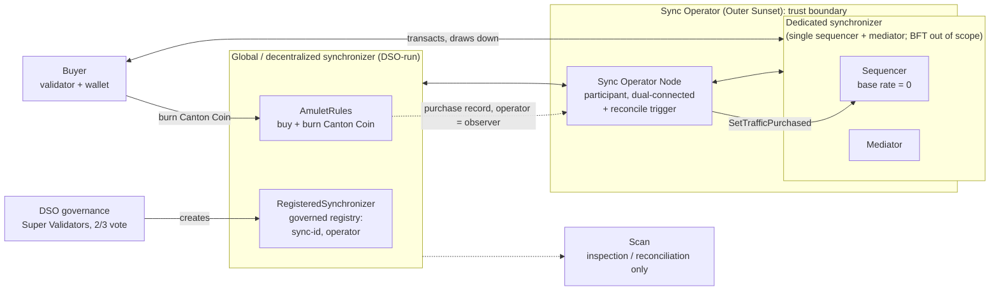
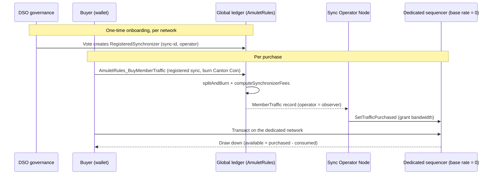

# Proposal: Extending Mainnet - Dedicated-Synchronizer Traffic

## Development Fund Proposal

**Author:** Outer Sunset

**Status:** Draft

**Created:** 2026-07-23

**Label:** canton-protocol-multi-synchronizer

**Champion:** TBD

## Abstract

Canton is a "network of networks." There is one shared, decentralized network that everyone can join,
the **Global Synchronizer**, operated jointly by a set of trusted operators called **Super
Validators**. Anyone can also stand up their **own** Canton network from the same open-source
software, for more throughput or lower cost. Today the economics only work on the one shared network:
using it costs money, you burn (permanently destroy) **Canton Coin** to buy **traffic** (the network's
metered bandwidth), and those fees feed Canton Coin's shared reward economy. Activity on any other
network consumes resources but burns nothing, so that value is economically disconnected from Canton
Coin. As more participants run their own networks, which the ecosystem actively wants in order to take
load off the shared network, that value fragments away from the token that is supposed to capture it.

This proposal funds Outer Sunset to close that gap by implementing a forthcoming Canton Improvement Proposal,
*"Extending Mainnet: Tokenomics Alignment Across the Entire Canton Network"* (to be proposed by
[PROPOSING GROUP]). The approach reuses what already exists: traffic on a dedicated, operator-run
synchronizer (also called a "dedicated" synchronizer) is **paid for in Canton Coin**, the same way
Global-Synchronizer traffic is today. A user burns Canton Coin on the shared network, tagged with the
dedicated network's identity, and that network's operator grants the purchased bandwidth on its own
infrastructure. Each dedicated network then contributes to, and earns from, one shared token economy.

The work is delivered as two milestones:

- **Milestone 1, MVP (no-discount):** a working, Canton-Coin-funded traffic manager for dedicated
  synchronizers, end to end. Register a network by governance, buy its traffic by burning Canton Coin,
  and the operator grants it automatically so the buyer can transact. This is the minimal viable
  product that plugs the economic leak, and it reuses machinery that already exists in the network
  software.
- **Milestone 2, PoC (tokenomics mechanisms):** a proof-of-concept that builds the *mechanisms* for
  the CIP's richer model, per-network pricing, discounts, commitment staking, and operator rewards, as
  parameterized variables carrying placeholder values. It proves the machinery is in place and
  configurable without implementing the advanced tokenomics themselves (the actual discount curves,
  staking economics, and reward policy), which stay as variables to be set once the model's open design
  decisions are finalized.

The rest of this document covers the deployment topology and data flow (with diagrams),
the delivery scope, the specification, the two milestones and their acceptance criteria, security considerations, funding,
adoption and a long-term sustainment commitment. Outer Sunset is well placed to
lead this: it is a **Super
Validator** (a member of the network's governing body), a **prospective operator** of a dedicated
synchronizer, and the **technical co-designer** grounding this CIP in the actual Canton source code
alongside [PROPOSING GROUP].

## Infrastructure Topology

Outer Sunset delivers the software and templates to stand up a dedicated synchronizer; the running
infrastructure is operated by the operator (Outer Sunset, for the pilot). The two diagrams below separate
what an operator runs (Diagram A) from how a single purchase flows through the system (Diagram B).

### Diagram A: Deployment topology

```mermaid
graph LR
  DSO["DSO governance<br/>Super Validators, 2/3 vote"]
  BUYER["Buyer<br/>validator + wallet"]
  SCAN["Scan<br/>inspection / reconciliation only"]

  subgraph GS["Global / decentralized synchronizer (DSO-run)"]
    AR["AmuletRules<br/>buy + burn Canton Coin"]
    REG["RegisteredSynchronizer<br/>governed registry:<br/>sync-id, operator"]
  end

  subgraph OP["Sync Operator (Outer Sunset): trust boundary"]
    SON["Sync Operator Node<br/>participant, dual-connected<br/>+ reconcile trigger"]
    subgraph DS["Dedicated synchronizer<br/>(single sequencer + mediator; BFT out of scope)"]
      SEQ["Sequencer<br/>base rate = 0"]
      MED["Mediator"]
    end
    SON <--> DS
  end

  DSO -->|creates| REG
  BUYER -->|burn Canton Coin| AR
  AR -.->|purchase record, operator = observer| SON
  SON -->|SetTrafficPurchased| SEQ
  SON <--> GS
  BUYER <-->|transacts, draws down| DS
  GS -.-> SCAN
```

**Caption.** Inside the "Sync Operator" boundary are the components Outer Sunset (or any operator) runs:
a **Sync Operator Node** (a participant connected to *both* synchronizers, onboarded to the Global
Synchronizer as an ordinary validator, running the reconcile trigger) and the **dedicated
synchronizer** itself (a single sequencer and mediator for the MVP; the sequencer is the component that
orders and meters a network's traffic, and a BFT multi-operator set is out of scope but not precluded). Outside it, operated by others: the **Global Synchronizer** (run by the DSO,
the Super Validators' collective governance body, where Canton Coin is burned and governance votes
happen), the **buyer's** validator and
wallet, and **Scan** (used for inspection only; the funding path does not poll it). The concrete
testbed is the Splice LocalNet `multi-sync` profile, which stands up a second `app-synchronizer` with
its own sequencer and mediator alongside the standard SV, app-provider, and app-user stack (stock
Splice images).

### Diagram B: Data flow of a single purchase

```mermaid
sequenceDiagram
    participant DSO as DSO governance
    participant B as Buyer (wallet)
    participant G as Global ledger (AmuletRules)
    participant O as Sync Operator Node
    participant S as Dedicated sequencer (base rate = 0)

    Note over DSO,G: One-time onboarding, per network
    DSO->>G: Vote creates RegisteredSynchronizer (sync-id, operator)
    Note over B,S: Per purchase
    B->>G: AmuletRules_BuyMemberTraffic (registered sync, burn Canton Coin)
    G->>G: splitAndBurn + computeSynchronizerFees
    G-->>O: MemberTraffic record (operator = observer)
    O->>S: SetTrafficPurchased (grant bandwidth)
    B->>S: Transact on the dedicated network
    S-->>B: Draw down (available = purchased - consumed)
```

**Caption.** A network is registered once by a governance vote. For each purchase, the buyer (or the
operator on the buyer's behalf) burns Canton Coin on the Global Synchronizer via a purchase choice
that reuses the existing fee and burn functions. The purchase produces an on-ledger record on which
the operator is an observer, so the operator's node ingests it event-driven with no polling. The
operator's reconcile trigger grants the corresponding bandwidth on the dedicated sequencer. Because
the dedicated sequencer's base rate is zero, a participant has no free allowance: available traffic
equals purchased minus consumed, so nothing can be transacted until a purchase is granted.

## Delivery Scope

The deliverable is source code, templates, and documentation. All shippable code lands in the
Apache-2.0 Splice fork (`canton-network/splice-multi-sync`); the on-ledger contract changes live in
the shared open-source Splice core packages (`splice-amulet`, `splice-dso-governance`) and are
activated on mainnet only by a DSO governance vote.

### In Scope

- **On-ledger Daml:** the `RegisteredSynchronizer` registry and its public `RegisteredSynchronizer_Fetch`
  read choice, the `DsoRules_RegisterSynchronizer` governance action, the extension of
  `AmuletRules_BuyMemberTraffic` to accept a registered synchronizer, the appended
  `operator : Optional Party` observer on the existing `MemberTraffic` record, operator lifecycle
  governance, and the Daml Script test suites (happy path plus negative cases).
- **Off-ledger automation (Scala):** extend the existing `MemberTraffic` reconcile and merge triggers
  to grant purchased traffic on a registered dedicated sequencer, and validator auto-top-up (a wallet
  operation plus a generalized top-up trigger).
- **Operator node and deployment:** the Sync Operator Node, Helm charts for a non-global synchronizer
  (single sequencer + mediator), an operator runbook, and logical-synchronizer-upgrade handling.
- **Observability:** extend Scan to index the registration and the per-synchronizer purchase
  dimension, and funding-side endpoints (list registered synchronizers; per-network purchased and
  burned totals; serve the registration a buyer attaches).
- **Tokenomics mechanisms (Milestone 2):** the parameterized machinery for per-synchronizer pricing, a
  discount factor, commitment staking, and operator rewards, wired in and populated with placeholder
  values. The advanced tokenomics themselves (the actual curve shapes, staking economics, and reward
  policy) are left as configurable variables; see Out of Scope.

### Out of Scope

- The **running pilot synchronizer infrastructure** and any hosted endpoints: the deliverable is the
  software and templates to stand one up, not operated services.
- **Consumption-side visibility:** consumption happens on the operator's own sequencer and is the
  operator's choice to expose; the funding-side Scan endpoints omit consumed totals by design.
- **BFT decentralization** of the dedicated synchronizer (multiple sequencers and mediators, an
  operator set): the MVP is a single sequencer and mediator.
- **Governance and upstream-maintainer decisions:** the contribution and merge model for the
  core-package Daml (upstream contribution vs. vetted fork packages).
- **The advanced tokenomics themselves:** the actual discount-curve shapes, transaction-class
  thresholds, staking economics and penalties, and reward formulas. Milestone 2 builds the
  parameterized mechanisms with placeholder values; the real values and policy are set later, once the
  proposing group and network governance finalize them.

## Specification

### 1. Objective

Extend the way Canton charges for and rewards network usage so that it covers dedicated synchronizers,
not just the one shared network. **Milestone 1 (MVP)** delivers a complete, no-discount path: a
dedicated synchronizer can be registered through governance, its traffic purchased by burning Canton
Coin on the shared network, and its operator automatically grants the purchased bandwidth on its own
sequencer so the buyer can transact. **Milestone 2 (PoC)** adds the *mechanisms* for the CIP's
richer model on top of that foundation: per-synchronizer pricing, a discount factor, commitment
staking, and an operator reward hook, each as a parameterized variable with a placeholder value. The
machinery is in place and configurable, but the tokenomics themselves (the curve shapes, staking
economics, and reward policy) are not set here; they come later. That groundwork is what a competitive
market of networks, all settling in one currency, will eventually require.

### 2. Implementation Mechanics

The MVP mechanism is three steps (see Diagram B):

1. **Register the network by governance.** A DSO supermajority vote creates a `RegisteredSynchronizer`
   record binding the network's id to its operator's party. This one-time onboarding vote exists so
   purchases route to the correct, trusted operator; a buyer cannot name an operator, which could be
   spoofed.
2. **Buy traffic by burning Canton Coin, on the shared network.** The buyer exercises
   `AmuletRules_BuyMemberTraffic` for the dedicated network, attaching the registration via explicit
   disclosure so the choice can admit a registered synchronizer and read its operator. The choice
   reuses the network's own `computeSynchronizerFees` and `splitAndBurn` functions unchanged, so the
   economics are identical to an ordinary traffic buy, and it records the purchase on a `MemberTraffic`
   record with the operator added as an observer.
3. **The operator grants the traffic.** The operator's reconcile trigger reads the purchased total from
   the operator-observed record and calls `SetTrafficPurchased` on the dedicated sequencer. The buyer
   then transacts on the dedicated network, drawing the balance down.

Much of the MVP already exists in the network software. The current member-traffic purchase is
synchronizer-aware and separates the payer from the participant that receives the traffic, so the buy
path is extended rather than rebuilt. The new work is the governance registration, the
registered-synchronizer extension to the existing purchase choice, the operator's grant automation, and
the operator node and its deployment. The governance registration is built and passes its Daml Script
tests; the buy path is being reworked to this agreed shape.

Milestone 2 adds these as parameterized mechanisms rather than finished tokenomics: a per-synchronizer
price, a discount factor in the fee computation at burn time, commitment and stake fields, and a
consumption-reporting-to-mint hook, each carrying a placeholder value. The tokenomics themselves, the
tiered curve shapes, transaction-class thresholds, staking penalties, and reward formulas, stay
configurable and are not implemented under this grant.

### 3. Architectural Alignment

This work advances core network priorities: **scaling the network** (it makes it economically viable
to move load off the shared Global Synchronizer onto dedicated networks), the **multi-synchronizer
protocol** direction (a first-class, sanctioned way to operate an extension network), and the
network's **tokenomics** (it extends the Burn-Mint Equilibrium, the model where fees are paid by
burning Canton Coin while new coin is minted on a schedule as rewards, so all value-generating activity
feeds one token economy). It is reuse-first and additive, designed with [PROPOSING GROUP] and
grounded in the real Canton and Splice source rather than a separate reimplementation.

### 4. Backward Compatibility

The design is additive and upgrade-safe. It appends an optional `operator` field to the existing
`MemberTraffic` record, adds one governance-action constructor (appended last, so existing constructor
ranks are preserved), and adds a registered-synchronizer gate inside the existing
`AmuletRules_BuyMemberTraffic` choice. An ordinary Global-Synchronizer purchase, which supplies no
registered synchronizer, behaves exactly as it does today, so current issuers and validators are
unaffected. Because the contract changes live in the shared Splice core packages (maintained by Digital
Asset), they land upstream through the network's contribution process and are activated by a DSO
governance vote; nothing changes on mainnet without that vote.

## Milestones and Deliverables

### Milestone 1: MVP - Canton-Coin-funded dedicated-synchronizer traffic (Workstream 1)

- **Scope:**
  - **On-ledger foundation:** the `RegisteredSynchronizer` registry and public read choice, the
    `DsoRules_RegisterSynchronizer` governance action, the registered-synchronizer extension to
    `AmuletRules_BuyMemberTraffic`, the appended `operator : Optional Party` observer on `MemberTraffic`,
    operator lifecycle governance, and the Daml Script test suites (happy path plus negative cases).
  - **Reconcile-to-sequencer automation:** extend the existing `MemberTraffic` reconcile and merge
    triggers to grant purchased traffic on a registered dedicated sequencer, hardened for unknown
    network ids.
  - **Sync Operator Node and deployment:** the operator's dual-connected participant plus a sequencer
    and mediator for the dedicated network, deployable via Helm charts with an operator runbook,
    including logical-synchronizer-upgrade handling.
  - **Zero base rate:** the dedicated sequencer configured so a participant cannot transact until
    traffic is purchased, and can once it is.
  - **Validator auto top-up:** a wallet operation and automation so a validator low on dedicated
    traffic buys more automatically.
  - **Observability:** read-only Scan endpoints for registered synchronizers and per-network purchased
    and burned totals (funding side).
- **Estimated resources:** Engineering: TBD; DevOps: TBD; Project Management: TBD
- **Estimated duration:** TBD
- **Amount:** TBD
- **Acceptance Criteria:**
  - A dedicated synchronizer operated by Outer Sunset serves Canton-Coin-funded traffic end to end,
    reproducible by a reviewer: a participant with zero base rate cannot transact; a purchase burns
    real Canton Coin on the shared network; the operator's automation grants the traffic; the
    participant then transacts and draws the balance down.
  - The on-ledger changes are on an agreed contribution path with the upstream maintainers, ready to
    be activated by a DSO governance vote.
  - An external operator can follow the published runbook to stand up a dedicated synchronizer with
    Canton-Coin-funded traffic.

### Milestone 2: PoC - mechanisms for the advanced tokenomics (Workstream 2)

This milestone builds the *mechanisms* for the CIP's richer model as parameterized variables carrying
placeholder values. It does not implement the advanced tokenomics themselves (the actual curve shapes,
staking economics, and reward policy); those remain configurable variables to be set once the open
design decisions are finalized.

- **Scope:**
  - **Per-synchronizer pricing mechanism:** make network fees configurable per synchronizer rather than
    a single global setting, carrying a placeholder price.
  - **Discount mechanism:** a discount-factor variable wired into the fee computation at burn time,
    with a placeholder value (no discount by default), plus the parameter surface for a transaction
    class. The actual tiered curve and class thresholds are not implemented.
  - **Commitment / staking mechanism:** the commitment/stake fields and contract structure,
    parameterized (stake amount, duration, penalty as variables) with placeholder values. The actual
    staking economics are not implemented.
  - **Operator reward mechanism:** a consumption-reporting-to-mint hook parameterized by a reward-ratio
    variable, with a placeholder value, respecting the network's schedule-driven minting. The actual
    reward policy is not implemented.
- **Estimated resources:** Engineering: TBD; DevOps: TBD; Project Management: TBD
- **Estimated duration:** TBD
- **Amount:** TBD
- **Acceptance Criteria:**
  - The parameterized mechanisms are demonstrated on-ledger: a per-synchronizer price, a discount
    factor, a stake, and a reward ratio can each be set as a variable and flow through the buy, grant,
    and reward paths with placeholder values, with no advanced-tokenomics policy hard-coded.
  - The proof-of-concept frames, for the proposing group and network governance, the open tokenomics
    decisions the model depends on (for example, whether reward minting is additive to the issuance
    schedule or drawn from it, and how self-reported activity on a private network is trusted), so the
    actual values, curves, and policy can be set later.

Note: Milestone 2 delivers the parameterized mechanisms only. The advanced tokenomics themselves are
deferred: they change the shared economic configuration and depend on decisions that only network
governance and the proposing group can finalize, so this milestone leaves them as placeholder-valued
variables to be set once those decisions land.

## Acceptance Criteria

Acceptance is measured by demonstrated ecosystem outcomes, not by code being written. In summary:
**Milestone 1** is accepted when a dedicated synchronizer serves Canton-Coin-funded traffic end to end
on a pilot operated by Outer Sunset, the on-ledger changes are ready for DSO activation, and an
external operator can reproduce the setup from the runbook. **Milestone 2** is accepted when the
parameterized mechanisms for per-synchronizer pricing, discounts, staking, and rewards are demonstrated
on-ledger with placeholder values (no advanced-tokenomics policy hard-coded), and the open tokenomics
decisions are framed for network governance and the proposing group so the real values can be set
later. The per-milestone criteria above are authoritative.

## Security Considerations

The mechanism moves real value (a purchase burns Canton Coin) and grants a real network resource, so it
carries a security posture proportionate to that.

**Security-critical components:**

- **The buy / burn choice** (the extended `AmuletRules_BuyMemberTraffic`, reusing `splitAndBurn` and
  `computeSynchronizerFees`): the single most sensitive on-ledger operation, since it destroys Canton
  Coin. It carries an `expectedDso` guard so a buyer cannot be tricked into transacting against a
  swapped-out rules contract.
- **The governance registration** (`RegisteredSynchronizer` + `DsoRules_RegisterSynchronizer`): the
  trust anchor. The operator party comes only from a governance-created registration, never from buyer
  input, so traffic cannot be bought for a spoofed operator; funding is impossible until a network is
  voted in.
- **The reconcile trigger** (`MemberTraffic` to `SetTrafficPurchased`): grants real, enforced
  bandwidth on the dedicated sequencer.
- **The Sync Operator Node:** the single trusted party in the MVP (the dedicated synchronizer is
  centralized). If later decentralized, trust moves to the operator set, exactly as the Global
  Synchronizer trusts its Super Validators.

## Funding

**Total Funding Request:** TBD in CC

### Payment Breakdown by Milestone

| Milestone | Focus | Amount (CC) |
| :--- | :--- | :--- |
| Milestone 1 | MVP: Canton-Coin-funded dedicated-synchronizer traffic (Workstream 1) | TBD in CC |
| Milestone 2 | PoC: parameterized mechanisms for pricing, discounts, staking, and rewards (Workstream 2) | TBD in CC |
| **Total** | | **TBD** |

Payments are milestone-based and released on committee acceptance of each milestone.

### Licensing

All grant-funded software is released under the Apache License 2.0 in the Splice fork
(`canton-network/splice-multi-sync`); the on-ledger changes carry the same license as part of the
shared Splice core packages. The proposal text is released under CC0-1.0. Each delivered component
ships its own SPDX headers and license file.

## Adoption Statement

Adoption is the primary measure of success. Outer Sunset is committed to real ecosystem usage of this
capability, presented here as a plan of intent rather than a funded acceptance gate:

- **A pilot dedicated synchronizer operated by Outer Sunset**, with Canton-Coin-funded traffic, for
  operators and issuers to evaluate against a live example.
- **Operator and issuer onboarding:** work with prospective synchronizer operators and token issuers to
  run their own Canton-Coin-funded networks using the published charts and runbook.
- **The competitive-marketplace vision:** the CIP's endgame is a market of networks that behaves like
  internet service providers, where users pick a synchronizer, operators compete on price and service,
  and everyone still settles in one common currency (Canton Coin). The MVP establishes the settlement
  link; Milestone 2 builds the parameterized mechanisms for the discounts and rewards such a market
  needs, ready to carry the actual tokenomics once they are finalized.

The richer parts of the CIP depend on network governance, since they change the shared economic
configuration the Super Validators collectively govern, and no single operator can ship them alone. The
MVP avoids that dependency: it reuses mechanisms that exist today, so its adoption does not wait on
those decisions.

## Rationale

- **Reuse-first and low-risk.** The MVP generalizes the network's existing "buy traffic by burning
  coin" flow rather than inventing new economics, so most of the mechanism is already proven in
  production. It ships as a working product before the more speculative tokenomics are attempted.
- **Two milestones matched to risk.** Milestone 1 is a buildable, verifiable MVP. Milestone 2 is a
  proof-of-concept that builds the *mechanisms* for the advanced model, parameterized and
  placeholder-valued, without implementing the tokenomics themselves, kept separate because the actual
  values and policy depend on decisions only network governance and the proposing group can make;
  funding it as a mechanisms-only PoC keeps expectations honest.
- **The right team.** Outer Sunset is simultaneously a governing Super Validator, a prospective operator,
  and the technical co-designer that has grounded this CIP in the real Canton and Splice source. The
  same team can design the mechanism, run a pilot, and help ratify it in governance.
- **Design choices already reasoned through.** Dedicated-synchronizer traffic runs through the same
  `MemberTraffic` record and the same purchase choice as Global-Synchronizer traffic, so the existing
  merge, reconcile, and Scan machinery is reused rather than duplicated. The changes are additive and
  upgrade-safe: an optional operator field on the record and a registered-synchronizer gate in the
  existing choice. Purchases are gated on a governance-registered synchronizer, so traffic can only be
  bought for trusted, operator-owned networks.

## Long-Term Sustainment

The ownership split is deliberate and durable. The substantive on-ledger contracts do **not** live with
Outer Sunset long-term: they land **upstream in the open-source Splice packages and are activated and
governed by the DSO** (the Super Validators collectively). What Outer Sunset owns and maintains is the
operator-side software (the Sync Operator Node, the reconcile and top-up automation, the Helm charts and
runbook) and its Super Validator governance position. Outer Sunset commits to best-effort upkeep of that
operator tooling as open infrastructure: security patches, critical bug fixes, and compatibility updates
as the standards and Canton mainnet evolve. All shippable code remains open (Apache-2.0) in the Splice
fork, and the operator artifacts remain available so any operator can continue to stand up a
Canton-Coin-funded dedicated synchronizer. Beyond the grant, longer-term maintenance options (a
Foundation-stewarded maintainer rotation, or an Outer Sunset paid-support tier for production operators) can
be discussed with the Foundation closer to the time; neither is a precondition for the baseline
commitment above.
