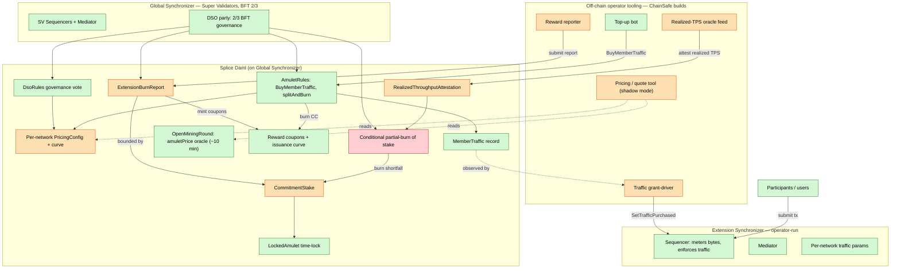
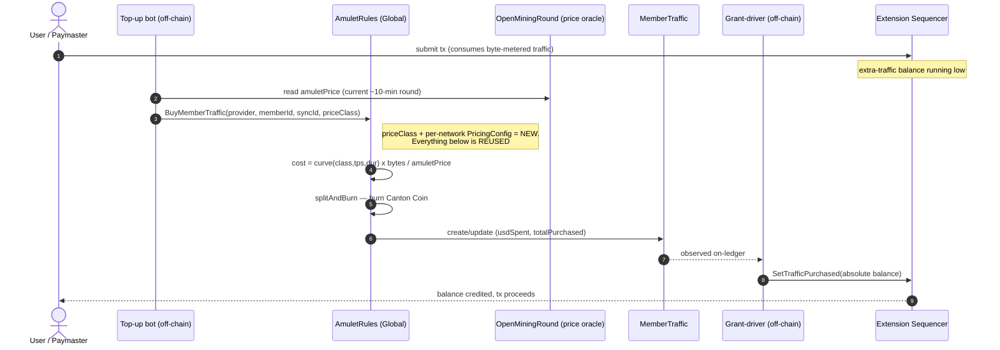
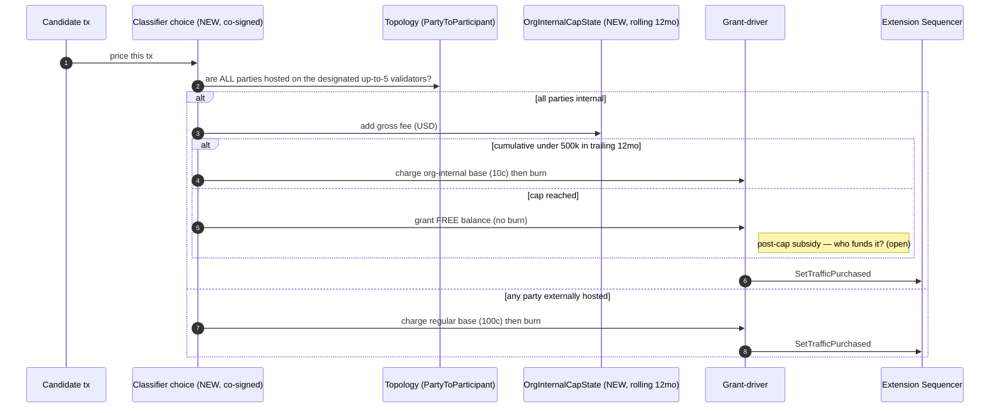
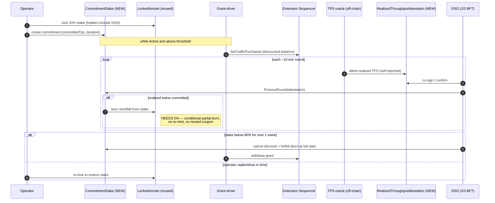
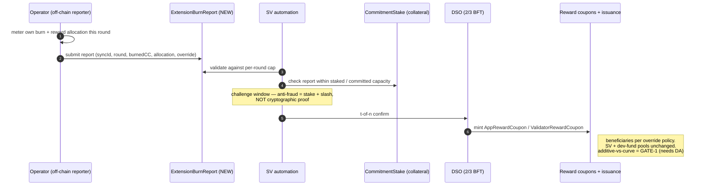

# Extending Mainnet: Tokenomics Alignment — Technical Plan & Feasibility Analysis

**Status:** Internal working draft (technical review of an external CIP)
**Author:** Sebastian Lindner (ChainSafe)
**Subject CIP:** "Extending Mainnet: Tokenomics Alignment Across the Entire Canton Network" — Shaul Kfir (Digital Asset), Type: Tokenomics, Status: Draft
**Audience:** ChainSafe engineering + management; input for the CIP authors / GSF
**Date:** 2026-06-22 · **Reconciled 2026-07-02** against the current CIP revision (three base prices; Example 2 corrected; §6.2 units now in years)

---

## 0. Read this first

This CIP is a **Splice / Canton-protocol + DSO-governance change.** The mechanisms it touches — sequencer traffic pricing, Canton Coin minting, DSO governance — are implemented in **Splice** (`github.com/canton-network/splice`) and **Canton** (`github.com/digital-asset/canton`). This is the Splice economic layer plus the Canton protocol and DSO governance — not end-user dApp code (Splice itself is DA's reference-application layer). The concrete deliverables this effort owns are (a) this analysis, (b) off-chain operator tooling (the realized-TPS oracle feed, the traffic grant-driver, a shadow-mode pricing/quote tool), and (c) ChainSafe's leverage **as a Super Validator and a prospective extension-synchronizer operator** to co-design, vote on, and pilot the spec.

You were told "the mechanism for purchasing traffic is the main point." That is correct, and §5.2 is the heart of this document. But the verification pass surfaced things that gate the whole effort and that the CIP under-states — read §1 and §7 before §5.

This document is grounded in the actual Splice/Canton source and docs. Template, choice, and parameter names below (`AmuletRules_BuyMemberTraffic`, `SetTrafficPurchased`, `SynchronizerFeesConfig`, etc.) are real and were verified against primary sources, not paraphrased.

---

## 1. Executive summary

The CIP wants one thing at the mechanism level: **turn Canton's single, flat, Global-Synchronizer-only traffic-purchase flow into a per-synchronizer, per-transaction-class, discount-curve-driven, optionally-staked pricing system that works across every synchronizer that extends Mainnet — while keeping all the burned value inside one Burn-Mint Equilibrium (BME).**

The good news: the **spine already exists and is reusable**. Canton already burns Canton Coin on-ledger to buy sequencer traffic (`AmuletRules_BuyMemberTraffic → splitAndBurn`), already separates the paying party from the credited member, already meters traffic per-synchronizer, already grants balances decoupled from burn (`SetTrafficPurchased`), already has USD→CC conversion via the mining-round price, already has on-ledger time-locks (`LockedAmulet`), and already has a governance state machine for economic parameters (`DsoRules` votes over `AmuletConfig`). Roughly 60% of what the CIP needs is "generalize and parameterize things that exist."

The hard news, in priority order:

1. **The "net cost" figures are a steady-state-BME identity — sound as steady-state economics.** The CIP body states only **90.25% of burn → app + validator operators, 9.75% net**. Our reconstruction of the 9.75% is **5% Canton Foundation dev fund (CIP-0082) + 4.75% Super Validators** (5% + 4.75% = 9.75%; 90.25% = 0.95 × 0.95) — but that decomposition is **ChainSafe's inference** (the CIP body states only 90.25%/9.75%), so present it as ours, not DA's. Because Burn-Mint Equilibrium means total mint ≈ total burn at steady state, "for every $1 burned, ~90¢ returns to operators" holds *at that equilibrium*, and §7's distribution-override is precisely what lets a synchronizer operator capture that 90.25% for its own activity. Two caveats are spec-editorial, not blockers: (a) these are the **stable emissions ~10 years post-launch** — today's split is SV-heavy and still migrating, so 9.75% net is a forward-looking floor, not today's reality; (b) BME equality is an *equilibrium* property (the CIP itself notes the network is currently inflationary, i.e. mint > burn — which makes net economics *better* than 9.75%), not a per-transaction protocol guarantee. So the table's "Net" columns are sound — just label them as steady-state economics.

2. **Three "independent" anti-fraud layers collapse into one trust assumption.** Activity on an extension synchronizer is *cryptographically invisible* to the Super Validators (Canton's per-synchronizer privacy model). So the realized-TPS metric (for staking), the reward report (for minting), and the burn-vs-credit link are all ultimately **self-attested by the same operator** on a single-operator synchronizer. The security of network-wide BME expansion reduces to an economic invariant the CIP never states: *staked collateral ≥ value of fraudulently-mintable rewards.*

3. **The two riskiest pieces are upstream changes ChainSafe cannot ship.** Metric-gated partial burning of a `LockedAmulet` principal is a **Splice Amulet Daml** change (new authorization + a DSO vote to activate); reassigning Amulet to where the DSO can witness/burn it is a **Digital Asset decision** (they govern the Canton-core repo and its release roadmap), while the *pinning* side is a **DSO-governance** knob (`requiredSynchronizers`). Both are upstream of ChainSafe — if either comes back "no," large parts of §5.4 and §5.5 are unbuildable as specified.

The single hardest **net-new primitive** — a trustworthy **realized-TPS / org-internal-spend oracle** — is on the critical path for the org-internal cap (§5.3), staking (§5.4), and reward reporting (§5.5) simultaneously. The privacy boundary, not the math, is the real ceiling on this CIP.

**Bottom line:** the mechanism is implementable and mostly reuses existing Splice machinery, but it is a **Splice/Canton-protocol + DSO-governance change**, and three feasibility/spec gates (§7) should be resolved before design freezes.

---

## 2. How Canton synchronizers actually work (primer)

You asked for this explicitly. Here is the mental model you need before the rest makes sense.

### 2.1 A synchronizer is an ordering service, not a ledger

A Canton **synchronizer** (older term: "domain") does **not** hold the ledger, does **not** validate transactions, and **cannot even read transaction contents.** The canonical analogy from the docs: *a post office handling sealed envelopes it cannot open.* It provides exactly two functions:

- **Sequencer** — a total-order multicast over *encrypted* messages. It establishes the single canonical ordering of all messages and delivers them to their designated recipients. It is the metering point for traffic (see §3.1).
- **Mediator** — the commit coordinator for Canton's two-phase-commit confirmation protocol. It collects stakeholders' confirmations and announces commit/reject verdicts **without seeing contract data**, and it keeps stakeholders from having to talk to each other directly (privacy).

A third role, the **topology/identity manager**, is a replicated state machine of signed *topology transactions* describing who exists and what they may do — `NamespaceDelegation` (signing authority), `PartyToParticipant` (which participant hosts a party, and at what permission level), `VettedPackages` (which Daml packages a participant will run), and so on. **Identity in Canton is cryptographic and explicitly decoupled from legal identity.** This matters enormously for §5.3: there is no native notion of "these validators belong to the same company."

### 2.2 Participants vs. validators vs. Super Validators

- A **participant node** holds the actual sub-ledger, runs Daml validation, and stores contract data. It joins a synchronizer by connecting to that synchronizer's sequencer(s), and it **can be connected to many synchronizers at once.**
- A **validator** (Splice terminology) is a participant node wrapped by the Splice **Validator app**, which adds the wallet, automation (including traffic top-up), and party management. "Validator" is *not* a separate consensus role.
- A **Super Validator (SV)** additionally runs core Global-Synchronizer infrastructure (a sequencer + mediator) and participates in governance. **ChainSafe is an SV** — this is our seat at the table for this CIP.

### 2.3 The Global Synchronizer is just *one* synchronizer

The **Global Synchronizer** is one decentralized synchronizer instance, run jointly by the SVs using BFT consensus (2/3 majority; with *n* SVs, normally 2f+1 sequencers agree), governed by the Global Synchronizer Foundation. Canton Coin minting and DSO governance happen **only here**.

Anyone can stand up **their own synchronizer** from the open-source Splice/Canton code — either centralized (single operator) or as a BFT consortium. These are the "**extension**" / "**application**" synchronizers the CIP is about. (Those two terms are informal labels for "any non-Global synchronizer"; the formal framework is CIP-0117 "Logical Synchronizers.") An extension synchronizer's operator **fully controls its own traffic parameters** — which is precisely why the CIP can scope the throughput discount to extensions: a third party cannot discount the Global Synchronizer's DSO-governed price, but an operator can set its own.

### 2.4 "Network of networks" = composability via reassignment

Composability across synchronizers does **not** come from a shared ledger. It comes from two Canton features:

1. A participant can be on multiple synchronizers simultaneously.
2. A contract can be **reassigned** between synchronizers (`UnassignCommand` → `AssignCommand`), provided *all its stakeholders are connected to both* the source and target synchronizer.

That enables atomic cross-synchronizer settlement (e.g. a delivery-vs-payment spanning two providers' synchronizers). This is what "Canton Mainnet is a network of networks" means concretely.

> ⚠️ **Caveat that the CIP depends on silently:** multi-synchronizer connectivity + reassignment was, in the docs reviewed, gated behind an alpha feature flag (`PARTICIPANT_FEATURE_FLAG_ENABLE_ALPHA_MULTI_SYNCHRONIZER`). And `AmuletDecentralizedSynchronizerConfig.requiredSynchronizers` may pin Amulet to the active (Global) synchronizer. Note the tension: if CC is pinned to Global, staked CC is *already* DSO-witnessable (no reassignment needed); the open question is whether that pinning holds and whether cross-synchronizer reassignment for composability is GA (GATE-2, §7).

---

## 3. What already exists (the substrate we build on)

### 3.1 The traffic-purchase flow — *the main point* — already works

This is the single most reusable thing. Today, on the Global Synchronizer:

1. **Metering (Canton protocol).** The sequencer charges each member for the messages it sequences, in **bytes**, not transactions. Cost includes a fan-out term:

   ```
   cost = byteSize × (1 + recipients × readVsWriteScalingFactor / 10000)
   ```

   Each member has a free, self-replenishing **base-rate** balance (a burst allowance) and a paid **extra-traffic** balance; base-rate is consumed first, and if both are empty the submission is rejected (`enforce_rate_limiting`). These byte-level params (`max_base_traffic_amount`, `read_vs_write_scaling_factor`, `enforce_rate_limiting`, `base_event_cost`, …) are **dynamic synchronizer parameters in topology — per-synchronizer, not Daml, not static node config.**

2. **Purchase + burn (Splice Daml, on-ledger).** A validator wallet exercises `AmuletRules_BuyMemberTraffic(inputs, context, provider, memberId, synchronizerId, migrationId, trafficAmount, expectedDso)` on the global `AmuletRules` contract. It **burns** Canton Coin via `splitAndBurn` (CC is removed from circulation — *not* paid to an operator) and creates/updates a `MemberTraffic` contract recording `totalPurchased / numPurchases / amuletSpent / usdSpent`. Crucially:
   - the choice **already carries `synchronizerId` and `migrationId`**, and
   - it **already separates the paying `provider` from the credited `memberId`** — so *payer ≠ beneficiary* (the paymaster model) is already expressible.

3. **Pricing (governed USD, settled in CC).** The price is `extraTrafficPrice`, denominated in **USD per MB**, stored in `SynchronizerFeesConfig` inside `AmuletConfig.decentralizedSynchronizer.fees` on `AmuletRules`. It is changed **only** by SV 2/3 on-ledger governance votes. The CC burned is derived, not fixed:

   ```
   trafficCostUsd    = trafficAmount_bytes / 1e6 × extraTrafficPrice      // $/MB
   trafficCostAmulet = trafficCostUsd / amuletPrice                       // amuletPrice from current OpenMiningRound
   ```

   So **the USD price is stable; the CC charged floats** with the round's `amuletPrice`. (Live MainNet `extraTrafficPrice` has been governed to ~$60/MB via CIP-0042/CIP-0084.) There is no separate CC/USD oracle to build — `amuletPrice` *is* the network's governed rate, ticked ~every 10 min and surfaced via the Scan API.

4. **Balance grant (Canton Sequencer Admin API).** SVs observe `MemberTraffic` and each push the new **absolute** balance into their own sequencer via the `SetTrafficPurchased` RPC (idempotent serial; applied once `SequencerSynchronizerState.threshold` sequencers agree). **`SetTrafficPurchased` is decoupled from the burn** — granting a balance and burning CC are mechanically separate steps. (This is the lever the commitment-discount uses — and also the thing that makes a single-operator synchronizer able to grant free traffic at will; see §6.)

5. **Auto-top-up (Splice Validator app, off-chain automation).** Configured by `targetThroughput` (bytes/s) and `minTopupInterval` (s); buys ~`targetThroughput × minTopupInterval` bytes whenever the extra balance falls below that and the interval has elapsed. This is exactly the ~10-minute cadence and "high capital efficiency" the CIP's §4 describes — it already exists.

> **Takeaway:** "per-synchronizer pricing" and "paymaster vs user-pays" do **not** require new sequencer machinery. They require new *pricing/policy state keyed by `synchronizerId`* and a *price-class-aware buy choice* that feeds the existing `splitAndBurn → MemberTraffic → SetTrafficPurchased` pipeline.

### 3.2 Canton Coin / BME — and the correction the CIP needs

Canton Coin ("Amulet" in code) runs a burn-and-mint model:

- **Burn:** USD-denominated fees (per-transaction `createFee`/`transferFee`/`holdingFee`, and per-MB traffic) are burned, converted to CC at the round's `amuletPrice`.
- **Mint:** new CC is issued on a **scheduled curve** — `issuanceCurve : Schedule RelTime IssuanceConfig`, with `amuletToIssuePerYear` (whitepaper steady state ~2.5B CC/yr, 100B/decade cap) divided across ~10-minute mining rounds (`OpenMiningRound → SummarizingMiningRound → IssuingMiningRound → ClosedMiningRound`). The per-round budget is split into pools — validator / app (featured vs unfeatured) / SV / faucet — *in proportion to activity "coupons"* (`AppRewardCoupon`, `ValidatorRewardCoupon`, `SvRewardCoupon`), all signed by the `dso` party. A ~5% Development Fund is deducted once from issuance (CIP-0082).

> ✅ **The 90.25 / 9.75 split is a steady-state issuance identity, not a phantom number.** The CIP body gives 90.25% app+validator / 9.75% net at steady-state BME. The finer **5% dev fund (CIP-0082) / 4.75% SV** split of the 9.75% is **ChainSafe's inference** — the CIP body states only 90.25%/9.75%, so present it as ours, not DA's. Since mint ≈ burn at equilibrium, ~90.25% of burned value returns to operators. Caveats: it's the **future** stable split (today is SV-heavy and migrating), and BME equality is an equilibrium property, not a per-tx rule. **Care still required:** the *mint* mechanism is the scheduled `issuanceCurve` (`amuletToIssuePerYear`), so the implementation must **not** encode "re-mint X% of each round's burn" — minting stays curve-driven; the 90.25% is what the equilibrium *produces*, not a per-round formula. The genuinely open tokenomics decision moves to §7 / GATE-1: whether report-driven minting for extension synchronizers is *additive to* or *drawn from* the curve.

### 3.3 Governance — the lever already exists

Economic parameters live in `AmuletConfig`, carried as a time-indexed `configSchedule` on the `AmuletRules` contract. Changes go through the `DsoRules` state machine:

```
DsoRules_RequestVote  →  DsoRules_CastVote  →  DsoRules_CloseVoteRequest
   (VoteRequest{ action: ActionRequiringConfirmation, voteBefore, targetEffectiveAt })
```

Economic-parameter changes use `action = ARC_AmuletRules` with `CRARC_SetConfig` (→ `AmuletRules_SetConfig`); applied at the 2/3 BFT threshold; **effective-dated** via `VoteRequest.targetEffectiveAt` (the older `AmuletConfig` `Schedule.futureValues` path is deprecated). Per-SV reward *weight* lives in `DsoRules.svs` and changes via `SRARC_UpdateSvRewardWeight`. There is an explicit extension point (`ExtActionRequiringConfirmation`) for new action types.

> **Takeaway:** every new global parameter this CIP introduces has a well-trodden path to existence — add a field to `AmuletConfig` (or a new `CRARC_*`/`ExtActionRequiringConfirmation` constructor) and gate it behind a `DsoRules` vote with `targetEffectiveAt`. No new governance machinery is required for the *global* parameters.

### 3.4 Locking — the staking primitive (mostly) exists

`LockedAmulet { amulet : Amulet; lock : TimeLock }` (with `TimeLock { holders, expiresAt, optContext }`) is the on-ledger time-lock, with `LockedAmulet_UnlockV2` / `LockedAmulet_OwnerExpireLockV2` / `LockedAmulet_ExpireAmuletV2`. This directly backs "escrow 20% of committed CC for the duration."

The closest **lifecycle precedent** is **CIP-0105 (SV reward locking, approved 2026-03)**: voluntary CC locking with a ~7-day under-lock detection window, a 30-day restoration period, and permanent forfeiture on failure — *structurally identical* to the CIP's replenish-or-forfeit rule. **But CIP-0105 forfeits governance *weight*, not the coins** — the locked CC is not destroyed; it vests back. So §5.4 can reuse the *state-machine shape* but **not** the economics: there is **no existing choice that conditionally burns part of a locked principal** based on an external metric (GATE-3, §7).

---

## 4. The gap: CIP requirement → what exists → what's net-new

| CIP § | Requirement | Exists today | Net-new work |
|---|---|---|---|
| 6.1–6.3 | Discount curve `P_type · dur(d) · T^log10(tps)`, **three** base prices (regular/app-internal/org-internal) | Single flat `extraTrafficPrice` ($/MB); USD→CC via `amuletPrice`; `DA.Math` log/pow | Per-synchronizer pricing record; the curve function; **two classifiers** (app-internal + org-internal); **cents/tx ↔ $/MB bridge** (undefined) |
| 6.4 | Org-internal class + ≤5 designated validators + $500k/12mo cap → zero credits | `PartyToParticipant` topology; `MemberTraffic.usdSpent` | "Same-operator" predicate; rolling-window accumulator; classifier choice; **who funds the post-cap free traffic** |
| 7 | Report extension burn → DSO mints app/validator rewards; distribution override | Coupon model + `FeaturedAppActivityMarker` beneficiary-splitting; `dso`-signed minting | Cross-synchronizer **report→mint** protocol (none exists; CIP-0104 removed self-reporting); anti-fraud bounding; additive-vs-curve BME decision |
| 8 | Stake 20%; per-round shortfall auto-burn (no rewards); replenish-or-forfeit | `LockedAmulet`/`TimeLock`; burn paths emit no coupons; CIP-0105 lifecycle shape; mining-round clock | **Realized-TPS oracle** (hardest); **metric-gated partial burn** of locked principal (upstream); per-round trigger |
| 6/8 | Discount restricted to extension synchronizers | Per-synchronizer dynamic params; Global price DSO-locked | Force throughput-discount = identity on Global (in code, not convention); discount delivered via `SetTrafficPurchased` grant, not pricing formula |
| all | Unified params, rollout, backward-compat | `AmuletConfig` + `DsoRules` vote + `targetEffectiveAt`; Scan | Param governance-tier split; schema migration proof; CC/USD-oracle sourcing for extensions; phased testnet plan |

**The recurring theme:** four primitives don't exist and everything else hangs off them — a **realized-TPS / org-internal-spend oracle**, a **conditional partial-burn** of locked stake, a **cross-synchronizer reward-reporting** protocol, and a **per-synchronizer pricing object**. The first three all run into the same wall: extension activity is invisible to the SVs.

---

## 5. Component designs

Each subsection: what it builds on, the recommended approach, and where the work lands (`canton-protocol` = upstream DA/Canton; `splice-daml` = Splice Daml packages; `splice-apps` = SV/validator Scala automation; `offchain` = operator tooling; `spec` = CIP text/decision).

**Logical architecture** (green = reused/verified today, orange = net-new, red = needs a Digital Asset protocol/governance decision):



### 5.1 Pricing curve (CIP §6.1–6.3) — effort: **L**

**Formula.** Gross price = `base × T^log10(max(1,tps))`. Verified against the CIP's §5 table with `T = 0.5`: 100¢ → 50¢ → 25¢ → 12.5¢ at 1/10/100/1000 TPS. ✅

**Notation bug to flag back to the authors (units now fixed; factor still off).** The duration discount only reproduces the published table as

```
dur(years) = Di × (1 − D)^log2(max(1, years))     // Di = 0.5, D = 0.25  →  0.500, 0.375, 0.326 for 1/2/3 yr
```

The current revision fixed the **units** (§6.2 now reads `d` in *years*, not months). But the formula as written — `Di · D^log2(max(1,d))` with `D = 0.25` — still does **not** reproduce the table: at 2 yr it gives `0.5 × 0.25 = 0.125` (→ ~1.2¢ net) where the table wants pay-0.375 (3.66¢ net). The remaining bug: the per-doubling factor must be **0.75** (a 25% *incremental* discount), i.e. `(1−D)`, not `D`. Note the asymmetry with the throughput side, where `T = 0.5` is already the *fraction paid* per decade. **Units are fixed; the `D` vs `(1−D)` factor still needs correcting, or the table is wrong.**

**Approach.** Put the curve in a **per-synchronizer** governed record (`SyncPricingConfig` / `ExtensionSynchronizerFeesConfig`), *not* on the global `AmuletRules`. Implement the curve as pure Daml using `DA.Math` (`logBase`, `**`), with the **throughput term forced to identity (1.0) when `isExtensionSynchronizer = false`** — enforcing "extensions only" in code, not convention. Reuse the existing USD→CC path verbatim (`priceUsd / amuletPrice`); **no new oracle.**

**The load-bearing modeling decision:** the curve produces **cents per transaction**; the sequencer charges **bytes**. These are not unit-convertible by a constant (see §6.A). Recommendation: store a governed `avgBytesPerTx` and have the operator's funding automation convert per-tx → $/MB; *or* redefine the operator's billing unit as per-tx with a flat per-tx allotment. Decide before coding.

**Work:** `[spec]` resolve §6.2 notation + cents/tx↔bytes; `[splice-daml/M]` `SyncPricingConfig` record; `[splice-daml/M]` curve function + a Daml test reproducing the §5 table; `[offchain/L]` funding automation that turns the computed price into `SetTrafficPurchased` grants / `BuyMemberTraffic` burns.

> **Strong recommendation:** adopt the **tiered** discount variant from the CIP's own "Alternatives Considered," not the smooth log curve. Daml `Numeric` has 10 fractional digits; `D^log2 · T^log10` accumulates rounding error and will drift from the published table, creating quote-vs-charge mismatches. Tiers (per 10× TPS, per 2× duration) kill that risk entirely and are easier to govern and explain.

### 5.2 Traffic-purchase mechanism for extension synchronizers (the main point) — effort: **XL**



**This is where ChainSafe should focus first** because (a) it's the CIP's core, (b) most of the spine already exists (§3.1), and (c) the off-chain half is the part we can actually build.

**Approach — reuse the spine, layer policy on top.** The enabling facts: `AmuletRules_BuyMemberTraffic` already carries `synchronizerId`/`migrationId` and already separates `provider` (payer) from `memberId` (credited); byte-level params are already per-synchronizer; `SetTrafficPurchased` grants independently of burn. So:

- **Per-synchronizer pricing state.** New `ExtensionSynchronizerFeesConfig` keyed by `synchronizerId`: the **three base prices** the current revision defines (regular 100¢ / app-internal 30¢ / org-internal 10¢, framed as a *utility discount* off the regular price), the discount params, committed `tps`/`duration`, the designated-validator list, the cap. On the Global Synchronizer this lives in `AmuletConfig`, settable only by SV vote, with the throughput discount forced to identity. On an extension synchronizer the operator's own governance owns it.
- **Price-class-aware buy choice.** Either a new `ExtensionSync_BuyMemberTraffic` or a `priceClass : {Regular|AppInternal|OrgInternal}` argument on the existing choice, selecting the per-synchronizer config by `synchronizerId` instead of the global `extraTrafficPrice`. **Reuse `splitAndBurn`, `MemberTraffic`, `expectedDso` unchanged.**
- **Paymaster vs user-pays.** A per-synchronizer `PaymasterPolicy : {UserPays | OperatorSubsidized | AppSubsidized}` + the subsidizing party. Because `provider ≠ memberId` is already legal, "enforcement" is mostly: operator automation buys credits for member parties (subsidized), or users buy their own (user-pays), optionally gating who may exercise the buy choice for a given `memberId`.
- **Capital efficiency falls out for free.** Reuse the existing top-up automation; the subsidizer buys only ~`targetThroughput × minTopupInterval` bytes per ~10-min interval — never floating a large balance. This *is* the CIP's §4 capital-efficiency claim.
- **Where the burn lands.** The burn still happens on the **Global** `AmuletRules` (CC and coupons are `dso`-signed and pinned to `activeSynchronizer`). The genuinely hard part — attributing that burn to the right reward pools for off-Global activity — is §5.5.

**Work:** `[splice-daml/L]` per-synchronizer fee config; `[splice-daml/M]` price-class-aware buy choice; `[splice-apps/M]` paymaster policy + automation; `[offchain/L]` operator top-up bot repointed at price class + paymaster `provider`; `[offchain/S]` extension sequencer honoring `SetTrafficPurchased` (single-operator: no BFT; consortium: threshold-applied).

> ⚠️ On a **single-operator** extension synchronizer the operator can grant unlimited free traffic via `SetTrafficPurchased` regardless of CC burned. The *only* thing tying credits to burn is the §5.5 honesty assumption. The burn-mint contribution is, mechanically, voluntary there. This is fine if framed honestly (the operator only cheats itself out of rewards) but it must be stated.

### 5.3 Transaction-class classification (regular / app-internal / org-internal) + $500k/12mo cap (CIP §6.4) — effort: **XL**



> **New in the current revision — three tiers, not two.** Pricing now has *three* base classes (regular 100¢ / **app-internal 30¢** / org-internal 10¢), framed as a **utility discount**. That adds a *second* classifier this analysis originally didn't cover: **app-internal** = "multiple parties *within a single application*" (e.g. a stablecoin transfer between two wallets), a **different and arguably harder** predicate than org-internal. "Same operator" is at least anchored in the ≤5-validator list; "same application" has no obvious on-ledger primitive — candidates are the transaction's Daml package-ID set or a featured-app identity, both needing a definition and an anti-gaming story. Treat app-internal classification as an open design question the CIP introduces.

**The core problem** (for the org-internal tier) **is that "same operator" is not an on-ledger concept.** Canton identity is cryptographic and *explicitly decoupled* from legal identity; there is no namespace primitive that says "these ≤5 validators and this synchronizer are one company." The CIP's ≤5-designated-validator list *is* the workaround — but it is operator-asserted, and the operator authors the `PartyToParticipant` topology for its own validators. So an operator can host a counterparty's party on a designated validator and label genuinely cross-org traffic as "internal" to ride 10¢ pricing and the post-cap free regime.

**Approach.**
- **Designated registry** of ≤5 validator participant IDs in the synchronizer's governed config; membership changes vote-gated and **rate-limited** (so an operator can't rotate the 5 to reset the accumulator), and the accumulator follows the *set*, not individual IDs.
- **Classifier choice** that takes the workflow's stakeholder set + a topology reference, verifies *every* party's `PartyToParticipant` host is in the designated set, and only then prices org-internal. **Must be DSO/threshold-co-signed** so the hosting predicate is independently re-derivable from signed, replicated topology — that's the only real defense against mislabeling. A single-operator synchronizer with no co-signers is inherently trust-based here.
- **Rolling-window accumulator** (`OrgInternalCapState`): windowed `(ts, grossFeeUsd)` entries summing `usdSpent`; flip to zero-burn at ≥$500k; age out entries past 12 months ("any 12-month period" = rolling, not calendar). Drive zero-burn grants via `SetTrafficPurchased` with **no CC burned**, while cross-org traffic stays on the burn path unconditionally.

**Two unresolved design forks** (must pick): (1) the sequencer charges bytes *when sequenced* and can't see parties, so org-internal members are either **pre-funded** at the 10¢ rate or **charged-then-reconciled** after on-ledger classification — these interact differently with the cap. (2) On the Global Synchronizer, post-cap zero-burn traffic is a **real subsidy** that breaks burn-mint accounting — *who funds it* (operator stake? DSO carve-out?) is an un-owned mechanism, not just a question. (My read: §6.4 is really intended for **extension** synchronizers, where the operator controls its own sequencer and bears its own cost.)

**Work:** `[splice-daml/M]` registry + two-tier price; `[splice-daml/L]` co-signed classifier; `[splice-daml/L]` rolling-window state; `[splice-apps/M]` window-maintenance + grant automation; `[offchain/M]` topology-derived audit/cross-check; `[governance/M]` anti-mislabeling + slashing spec.

### 5.4 Commitment staking + shortfall auto-burn (CIP §8) — effort: **XL**



**Approach — thin orchestration over `LockedAmulet`.** A new `CommitmentStake` template (signatories `dso` + `operator`) indexes one or more standard `LockedAmulet` escrows whose `TimeLock.holders` include the `dso` (so the DSO can burn from them), and carries `committedTps`, `committedDurationMonths`, `perRoundBurnRate`, `status : {Active|UnderThreshold|Forfeiting|Settled}`, thresholds. Custody, unlock, and expiry are all existing `LockedAmulet` mechanics; burning uses the existing `splitAndBurn` path **which already emits no reward coupons** — so "burn without yielding rewards" needs no new burn *semantics*, only a new contract that calls a burn on a metric condition.

**Two genuinely net-new pieces:**
1. **Realized-throughput attestation** (the long pole, shared with §5.3 and §5.5). Because extension activity is invisible to SVs, this is a **self-reported, DSO-co-signed** `RealizedThroughputAttestation { dso, operator, syncId, round, realizedTps, observedBurnCc }`, fed from the operator's own sequencer metering + Scan-style data. Consider requiring multi-SV confirmation to harden it. **There is no native realized-TPS quantity on-ledger today.**
2. **Metric-gated partial burn** (`CommitmentStake_ProcessRound`, controller `dso`): compute `shortfall = max(0, committedTps − realizedTps)`, convert to CC at the round `amuletPrice`, burn that much from the escrow **with no re-mint and no coupon**. Mechanically like expiry-archival, but condition-gated — **no existing choice does this, and it touches upstream Splice Amulet** (GATE-3).

**Lifecycle** copies CIP-0105's shape (under-threshold detection window → restoration period → forfeiture) but **swaps the economics**: forfeiture = sustained per-round burn of the *entire* remaining stake at the committed full rate until exhausted, then `Settled`. Replenishment re-locks fresh Amulet and clears the timer.

**Discount delivery is out-of-band:** native pricing can't be made forward-looking, so while a stake is `Active`+above-threshold, off-chain automation grants a subsidized absolute traffic balance via `SetTrafficPurchased` and withdraws it the instant status leaves `Active`.

**Cross-component hazards** (§6.C, §6.D): the stake is denominated in **CC** but the commitment is in **USD**, so an `amuletPrice` swing can trip forfeiture with zero change in throughput (needs continuous re-marking or it's an FX liquidation hazard). And the anti-fraud bound in §5.5 *depends on this stake*, while the shortfall burn *depends on the same operator-signed TPS number* — collateral and the thing it bounds are signed by the same party.

**Work:** `[splice-daml/S]` `CommitmentConfig` in `AmuletConfig`; `[splice-daml/L]` `CommitmentStake` template; `[splice-daml/XL]` attestation template; `[splice-daml/L]` `ProcessRound` partial-burn (Splice Amulet change; pending GATE-3); `[splice-daml/M]` `Replenish` + `CheckThreshold`/forfeit; `[offchain/L]` per-round trigger + grant-driver + TPS oracle feed.

### 5.5 Reward reporting + distribution override (CIP §7) — effort: **XL**



**The decisive fact:** burn and mint are independent (§3.2), so §7 is **not** "re-route 90% of burn." It is a **new issuance mode** in which the DSO mints CC into app/validator pools *from a self-reported extension-synchronizer burn figure*, leaving SV and dev-fund pools on their existing curve-based path. It deliberately **inverts CIP-0104**: CIP-0104 (approved) derives app rewards from SV-*observed* Global traffic and *removed* self-reporting; §7 *reintroduces* self-reporting because the activity is cryptographically invisible. That inversion is the whole reason anti-fraud is load-bearing.

**Approach — report-then-mint, mirroring CIP-0104's "one coupon per party per round" shape:**
1. `ExtensionSynchronizerConfig` in `AmuletConfig` (DSO-voted): operator, `rewardOverride : {KeepAll | DistributeToUsers [(Party,weight)] | PaymasterCashback | DefaultSplit}`, `perRoundBurnCap`, `requireStake`.
2. Operator submits a per-round `ExtensionBurnReport` to the `dso` party.
3. SV automation validates against caps + the §5.4 stake, holds it through a challenge window, and on *t*-of-*n* SV confirmation exercises a DSO mint choice creating `AppRewardCoupon`/`ValidatorRewardCoupon` for the target `IssuingMiningRound`. The **override** is applied purely at coupon-creation time via beneficiaries (reusing `FeaturedAppActivityMarker`'s beneficiary-weights-sum-to-1.0 logic) — so it can only *redistribute* the pool, never inflate it.

**Anti-fraud is governance + stake + slashing, NOT cryptographic verification — and the spec must say so.** Bounds: a hard per-round cap; a TPS-derived ceiling tied to the §5.4 committed/staked capacity (a report can't exceed what the stake could plausibly have burned); `amuletPrice` consistency; monotonic round numbering (anti-replay); and an SV challenge → slash-the-stake path. The stake is the economic collateral backing the self-report.

**BME reconciliation is the biggest tokenomics decision (GATE-1):** is report-driven mint **(A) additive** to the issuance curve (matches the CIP's "expand BME network-wide" language, but changes the 100B/decade cap and steady-state semantics) or **(B) drawn from / capped by** the existing per-round budget (preserves the cap)? The CIP implies A; A means SVs must accept that *self-reported numbers directly expand issuance* — which sharpens every anti-fraud requirement above.

**Work:** `[splice-daml/L]` `ExtensionSynchronizerConfig`; `[splice-daml/XL]` `ExtensionBurnReport` + DSO mint choice; `[splice-daml/L]` bounding logic; `[splice-daml/M]` override application; `[splice-daml/L]` BME reconciliation rule (A vs B); `[splice-apps/L]` ingest/challenge/mint triggers; `[offchain/L]` operator reporter; `[governance/M]` new `CRARC_*`/`ExtActionRequiringConfirmation` constructors.

> ⚠️ **Override beneficiaries can strand rewards.** `DistributeToUsers`/`PaymasterCashback` create coupons for users, but coupons live on the Global Synchronizer where the DSO is hosted, and those parties may exist only on the extension synchronizer — colliding with the **party-hosting wall** already tracked for the USDCx MVP (no retroactive observer addition). Beneficiaries must be resolvable/hosted on the Global Synchronizer.

### 5.6 Governance, parameters & rollout — effort: **XL (mostly spec)**

**Split parameters by who must trust them.**

- **GLOBAL DSO governance** (DsoRules vote, 2/3 BFT, `targetEffectiveAt`) — anything that keeps BME unified network-wide and that an operator must *not* be able to bend: base prices (100¢/30¢/10¢), discount factors (T, D, Di), floors (TPS≥1, ≥1yr, ≥1mo commit), stake % (20%), org-internal cap ($500k / 12mo / ≤5), replenish/forfeit params (~80% / ~1wk), the **rule that the throughput discount is forbidden on the Global Synchronizer**, and the CC/USD oracle source.
- **PER-SYNCHRONIZER operator config** (no global vote) — local business choices: *which* ≤5 validators are designated, whether to actually offer the discount and at what committed TPS/duration, and the reward-distribution override.

The Global Synchronizer is then modeled as **just one synchronizer whose per-synchronizer record is pinned to {regular pricing, throughput discount disabled}** — which is exactly the backward-compatible default, so a pre-CIP one-entry world maps to today's behavior unchanged.

**Backward-compat is a hard test obligation, not a doc.** Extending `AmuletConfig.decentralizedSynchronizer` from a single `activeSynchronizer` to a keyed `Map synchronizerId → config` touches the single global config the live network depends on. There must be a **CI gate proving Global pricing is byte-for-byte unchanged** under the new schema, plus a DAR-upgrade plan and possibly a Canton protocol-version bump if new dynamic synchronizer params are added.

**Phased rollout:**
- **Phase 0 (spec):** resolve GATE-1, run GATE-2/3 feasibility spikes, decide smooth-vs-tiered + cents/tx↔bytes + the app-internal/org-internal predicates. Output: this doc → a ratified spec + param governance-tier inventory.
- **Phase 1 (DevNet, shadow):** per-synchronizer config + curve compute **off-ledger only** — validate the math against the §5 table; no burn, no grant. *This is the part ChainSafe can build independently, with no upstream dependency.*
- **Phase 2 (TestNet, one extension synchronizer):** real `SetTrafficPurchased` grants + commitment stake with shortfall burn; Global Synchronizer untouched as control; exercise replenish + forfeiture.
- **Phase 3 (TestNet):** cross-synchronizer reward-reporting + override against a test DSO.
- **Phase 4 (MainNet):** DSO vote sets global bounds and pins Global to no-discount; onboard the first production extension synchronizer.

---

## 6. Where the components fight each other (integration risks)

Each design is internally coherent; the seams are where this gets dangerous.

**A. Pricing unit ⟂ charging unit.** Curve = **cents/tx**; sequencer = **bytes** with a fan-out multiplier. A DvP across synchronizers (canonical "regular" tx) has high fan-out → high byte cost; a trivial internal transfer is cheap — yet the CIP prices them flat at 100¢/30¢/10¢ *per tx*. Any `avgBytesPerTx` constant is gameable both directions (pack ops to ride the per-tx price; or get hit by fan-out the per-tx price didn't anticipate). **This is the single biggest technical contradiction** and it sits between the two largest components.

**B. Forward-looking discount ⟂ consumption-measured pricing.** The discount can't live in the pricing formula; it lives at the `SetTrafficPurchased` grant layer — which is decoupled from burn. So pricing curve + staking burn + reward report are **not three independent mechanisms; they're one trust triangle.** On a single-operator synchronizer all three vertices are operator-controlled.

**C. Anti-fraud circularity.** §5.5's bound = "report ≤ what staked TPS could burn" → depends on §5.4 stake. §5.4 shortfall burn → depends on the realized-TPS oracle. The oracle is operator-self-attested. **The collateral and the number it bounds are signed by the same party.** Three "layered defenses" = one assumption wearing three hats.

**D. Stake denomination mismatch.** Price locked in **USD**, stake locked in **CC**. `amuletPrice` moves → CC value of stake drifts from 20% of committed USD → can trip the 80% forfeiture threshold with **zero** throughput change. Needs continuous re-marking or operators get FX-liquidated.

**E. Org-internal timing.** Sequencer charges at sequencing time and can't see parties; classification needs post-validation `PartyToParticipant`. Pre-fund vs reconcile-after interact differently with the cap accumulator — pricing and org-internal-cap components must agree on one model.

**F. CIP-0104 ⟂ §7 coexistence.** A *shipped, approved* CIP that *removed* self-reporting must coexist on the same `AmuletRules` with a new one that *reintroduces* it. Both create `AppRewardCoupon` into the same pools/rounds. No spec yet for a party active on *both* Global and an extension synchronizer avoiding double-earning.

**G. DSO load.** §5.5 and §5.4 both put per-round, per-synchronizer DSO-party transactions on the Global Synchronizer — the most expensive transactions on the network (validated by all SVs at 2/3 BFT). At N synchronizers × 10-min rounds this is a Global-Synchronizer **congestion vector** — potentially making it *slower*, the opposite of the CIP's stated goal. Needs a capacity model + batching/admission control (likely per-window, not per-round).

---

## 7. Decision gates (resolve before design freezes)

In strict gating order. The first three are **go/no-go**; if any returns "no," large parts of §5.4–§5.5 are unbuildable as specified.

- **GATE-0 — Net-cost framing (editorial, resolved).** The 90.25%/9.75% split is a steady-state-BME identity (valid ~10 yr out), so the table's Net columns are sound. The finer 9.75% = 5% dev fund + 4.75% SV breakdown is **ChainSafe's inference** (the CIP body states only 90.25%/9.75%) — present it as ours, not DA's. Actions: implement minting as the curve (not a fixed % of burn) and label the Net columns as *steady-state* (today's split is SV-heavy/migrating; the network is currently inflationary, so net is better than 9.75% now). The live tokenomics gate is GATE-1.
- **GATE-1 — Additive vs curve-bound issuance.** Does report-driven mint *expand* issuance (changes the 100B/decade cap) or draw from the existing budget? **The single biggest tokenomics decision.** → *spec/SV ratification*
- **GATE-2 — Where staked CC lives + reassignment GA.** Two linked questions: (i) if Amulet is *pinned to the Global Synchronizer* (per §5.2), staked CC already sits where the DSO can witness/burn it and **no reassignment is needed** — confirm that pinning holds; (ii) the "network of networks" composability (§2.4) still needs **multi-synchronizer reassignment to be GA, not alpha**, in the targeted Canton version. (The earlier framing — "reassign Amulet *to* Global" — was backwards if CC never leaves Global.) → *canton-protocol spike*
- **GATE-3 — Partial burn authorization.** Can a DSO-co-signed choice burn *part* of a third-party `LockedAmulet` principal with no re-mint and no coupon? **Net-new authorization in upstream Splice Amulet that ChainSafe does not control.** → *splice/canton spike*
- **GATE-4 — Realized-TPS trust model.** Is there *any* verification (multi-SV confirmation, Scan cross-check, fraud proof), or pure trust+slash? If pure trust, the whole BME-expansion security reduces to the unstated invariant **stake value ≥ mintable rewards.** → *spec + design*
- **GATE-5 — DSO governance-throughput budget.** Model worst-case per-round DSO transaction load across N synchronizers before committing to per-round (vs per-window) reporting/burn. → *capacity model*

Plus two spec decisions that aren't go/no-go but block coding: **smooth vs tiered** discount (recommend tiered, §5.1) and the **cents/tx↔bytes** modeling choice (§6.A).

---

## 8. Sequencing

```
Phase 0  Spec & feasibility spikes  ── GATE-1 (BME additive-vs-curve)  +  GATE-2/3 (upstream go/no-go)  +  smooth/tiered + unit decision
            │  (blocks all code)
            ▼
Phase 1  Parallelizable foundation (Splice-Daml + OFF-CHAIN here)
            • per-synchronizer pricing config + governance-tier split
            • curve function + §5 table reproduction test
            • off-chain quote tooling in SHADOW MODE  ← buildable now, no upstream dep
            ▼
Phase 2  The long pole (mostly serial, upstream)
            • realized-TPS / org-internal-spend ORACLE   ← critical path for §6.4, §7, §8 at once
            • commitment-stake + partial-burn choice (gated on GATE-3)
            • org-internal cap accounting (needs oracle + classifier)
            ▼
Phase 3  Highest-trust, last (governance + upstream)
            • cross-synchronizer reward-reporting + mint bridge + override (needs stake + oracle + GATE-1)
            ▼
Phase 4  Rollout: shadow → 1 TestNet extension sync (Global as control) → reward-reporting on test DSO → MainNet DSO vote
```

The realized-TPS oracle is the critical path. For extension synchronizers it is fundamentally a *trusted attestation, not a verifiable measurement* — that privacy boundary, not the math, is the real ceiling.

---

## 9. Where the work lives & ChainSafe's role

| Layer | What | Who controls it |
|---|---|---|
| **Canton protocol** (upstream DA) | Amulet-reassignment capability + whether multi-sync reassignment is GA (out of alpha); any new dynamic synchronizer params | Digital Asset / Canton core — **ChainSafe cannot ship unilaterally** |
| **Splice Daml** (open-source, DSO-activated) | per-synchronizer pricing config; the `requiredSynchronizers` pinning policy (DSO-governed); curve function; price-class buy choice; **app-internal + org-internal classifiers** + cap; commitment-stake orchestration + **metric-gated partial-burn choice**; reward-report template + mint choice + override; new `CRARC_*` constructors | community PRs to `canton-network/splice` + a DSO vote to activate |
| **Splice apps** (Scala automation) | SV-app triggers: report ingest/challenge/mint; per-round shortfall trigger; window maintenance | community / SV operators |
| **Off-chain operator tooling** | realized-TPS oracle feed; `SetTrafficPurchased` grant-driver; top-up automation repointing; operator reward-reporter; **shadow-mode pricing/quote tool** | **ChainSafe — as an SV / extension-synchronizer operator** |

**The substantive Daml lands upstream in Splice** (`canton-network/splice`) — it compiles against Splice Amulet. The deliverables this effort owns are: (1) this plan, (2) the off-chain oracle / quote / grant tooling, and (3) ChainSafe's SV governance position. The whole CIP modifies the global `AmuletConfig` schema and BME semantics that the SVs collectively govern, so it **needs GSF/DA buy-in regardless** — ChainSafe's leverage is as a co-designer, a TestNet pilot operator, and an SV vote.

---

## 10. Questions to take back to the CIP authors

1. **Net-cost framing (GATE-0):** please confirm the decomposition of the 9.75% net — is it **5% dev fund (CIP-0082) + 4.75% SV**? The CIP body states only 90.25%/9.75%, so we're treating our breakdown as an inference until you confirm. Either way, please label the table's Net / Discounted-Net columns as *steady-state* (~10 yr) economics (today's split is SV-heavy and migrating; the network is currently inflationary, so net is better than 9.75% today). **Open (GATE-1):** is §7 report-driven minting *additive* to the issuance curve or *drawn from* it? (Determines whether this changes the 100B/decade cap and BME semantics network-wide.)
2. **§6.2 formula:** the current revision fixed the units (`d` in **years**), but the formula still uses `D=0.25` where matching the table needs a per-doubling factor of **0.75** (= `1−D`) — at 2 yr the written formula gives 0.125, the table wants 0.375. Please confirm the intended formula.
3. **Discount function:** smooth log curve or tiered? (Strongly recommend tiered to avoid Daml `Numeric` rounding divergence between quote and on-chain charge.)
4. **cents/tx ↔ bytes:** the curve prices per transaction; the sequencer charges bytes with a fan-out multiplier. What is the canonical conversion, and how is it protected from gaming?
5. **"Same operator":** Canton identity doesn't encode legal org. Is the ≤5-validator list the *definition* of "org-internal," and must classification be DSO/threshold-co-signed (the only defense against mislabeling)?
6. **Org-internal cap:** who funds the post-cap zero-burn traffic (it's a real network cost)? Is §6.4 intended only for extension synchronizers? Rolling vs calendar window? Per-validator-set or per-synchronizer?
7. **Staking:** 20% of *which* CC (committed gross burn?), sized at *which* `amuletPrice`, and is it re-marked as the price moves (to avoid FX-driven forfeiture)? Are 80%/1-week normative or illustrative?
8. **Realized-TPS oracle:** how is it measured and attested for invisible extension activity, and is there *any* verification beyond trust+slash?
9. **DSO load:** per-round vs per-window reporting/burn — what's the capacity budget as the number of extension synchronizers grows?
10. **CIP-0104 coexistence:** how does a party active on both Global and an extension synchronizer avoid double-earning app rewards?
11. **Two editorial nits in the current revision:** the 3-tier base price now appears both in §6 *and* still under "Alternatives Considered"; and §6.3's formula prose says the price adjusts by "(regular, org-internal)" — omitting the new app-internal tier.

---

## 11. Numerical check of the CIP's worked examples (§4–§5)

I re-derived every number from the formula (gross `= base · 0.5^log10(tps)`; duration `= 0.5 · 0.75^log2(years)`; net `= ×0.0975`; seconds/yr `= 31,536,000`; stake `= 20% of committed burn over the full duration`). Summary: **all four examples are now arithmetically self-consistent** (with two nits). *Example 2 contained a real 1yr/2yr error in the earlier draft; the current revision corrected it (now 3.13¢ / 0.30¢) — don't raise it.* The reason 1 and 4 *look* wrong is two table-reconciliation traps, called out below.

| Example | Stated | Derived | Verdict |
|---|---|---|---|
| **1 — RWA** (1 TPS, 12mo) | 50¢/tx; 45¢ redistributed; $15.8m burn/12mo; ~$3m stake | 50.0¢; 45.1¢; $15.8m; $3.2m stake | ✅ correct |
| **1b** (10 TPS, 24mo) | 18.75¢ (1.83¢ net); $24m stake | 18.75¢ (1.83¢); $23.7m | ✅ correct |
| **2 — payments** (1000 TPS, 12mo) | 12.5¢→6.25¢ (0.61¢ net); $395m stake | 12.5¢→6.25¢ (0.61¢); $394m | ✅ correct |
| **2 — "10k TPS, 1-year commitment"** | current revision: **3.13¢ / 0.30¢** | 1yr = 3.13¢ / 0.30¢ | ✅ **fixed** (earlier draft had 2.34¢/0.23¢ = the 2-yr figures) |
| **3 — bank-internal** (1 TPS, org 10¢) | 10¢ (0.9¢ net); $500k = 5M tx | 10¢ (**0.98¢** net); $500k ✓ | ⚠️ net should be ~0.98¢, not 0.9¢ |
| **4 — trading venue** (1000 TPS, 12mo) | $1 → 6.25¢ (0.61¢ net) | $1 = Global regular (100¢); 6.25¢ (0.61¢) | ✅ correct |

**Why Example 1 *looks* wrong (it isn't):** the §5 table says 1 TPS = **100¢ gross / $31m per year**, but Example 1 says **50¢ / $15.8m**. The table columns are the **gross (no-commitment)** price; Example 1 applies the **12-month commitment**, which halves price (100¢→50¢) and therefore halves annual burn ($31m→$15.8m). Stake is **20% of the *committed* burn** ($15.8m), = $3.2m — *not* 20% of the gross $31m (which would be ~$6.3m). Both reconcile cleanly.

**Why Example 4 *looks* wrong (it isn't):** the table says 1000 TPS gross = **12.5¢**, yet Example 4's "before" price is **$1**. The $1 is the **Global Synchronizer regular price (100¢)** — the throughput discount is *extension-only* (§6.1), so even at 1000 TPS the Global Synchronizer charges the flat regular price. The $1 is therefore the *Global* baseline, not the *extension* gross. (Presentational caveat: the example compresses two effects — moving to an extension synchronizer already cuts $1→12.5¢ (8×); the commitment only adds 12.5¢→6.25¢ (2×). And "$1" is itself a price this CIP *introduces*, not today's actual per-MB cost — so "reducing from $1" frames a new-model number as the status quo.)

**Example 2 — corrected in the current revision.** The earlier draft read "10k TPS, **1-year** commitment → **2.34¢ (0.23¢ net)**," but 2.34¢/0.23¢ are the **2-year** figures. The current revision fixes this to **3.13¢ (0.30¢ net)**, matching the table's 10k-TPS 1-year columns. No longer an issue — noted only so we don't raise a stale point with DA.

**Conceptual flag spanning 1 and 4:** the CIP only says the *throughput* discount is extension-only (§6.1); it never states whether the *duration* discount is. Example 1 (a **1 TPS** issuer staking for a duration discount) only makes economic sense if either (a) the duration discount is available on the Global Synchronizer too — in which case the issuer needs no extension synchronizer at all — or (b) running an extension synchronizer for a 1-TPS workload is worth it purely for the duration discount, which is dubious. This scope ambiguity should be resolved in the spec.

---

## 12. Appendix — glossary of real Splice/Canton identifiers

| Identifier | What it is |
|---|---|
| `AmuletRules` | Global tokenomics contract; carries `configSchedule : Schedule AmuletConfig` |
| `AmuletConfig` | Economic params: `transferConfig`, `issuanceCurve`, `tickDuration`, `decentralizedSynchronizer`, … |
| `SynchronizerFeesConfig` | `{ extraTrafficPrice ($/MB), baseRateTrafficLimits, readVsWriteScalingFactor, minTopupAmount }` |
| `AmuletRules_BuyMemberTraffic` | Choice that burns CC (`splitAndBurn`) to buy extra traffic; carries `provider`, `memberId`, `synchronizerId`, `migrationId`, `trafficAmount` |
| `MemberTraffic` | Per-`{dso,memberId,synchronizerId,migrationId}` record of `totalPurchased / amuletSpent / usdSpent` |
| `SetTrafficPurchased` | Sequencer Admin API RPC; sets an **absolute** traffic balance (serial-idempotent); **decoupled from burn** |
| `OpenMiningRound.amuletPrice` | Governed CC/USD rate; ~10-min `tickDuration`; the existing USD→CC oracle (via Scan) |
| `OpenMiningRound → SummarizingMiningRound → IssuingMiningRound → ClosedMiningRound` | Mining-round lifecycle |
| `IssuanceConfig` / `issuanceCurve` | `amuletToIssuePerYear` + reward-pool split (validator/app %, remainder SV), ~5% dev fund (CIP-0082) |
| `AppRewardCoupon` / `ValidatorRewardCoupon` / `SvRewardCoupon` | `dso`-signed activity coupons minted into reward pools |
| `FeaturedAppActivityMarker` | Beneficiary-weighted reward-splitting primitive (reused for the §7 override) |
| `DsoRules` + `VoteRequest`/`CastVote`/`CloseVoteRequest` | Governance state machine; `ARC_AmuletRules` + `CRARC_SetConfig`; `targetEffectiveAt` |
| `LockedAmulet { amulet; lock : TimeLock }` | On-ledger time-lock; the staking escrow primitive |
| `PartyToParticipant` | Topology mapping: which participant hosts a party, at what permission level (org-internal predicate source) |
| `activeSynchronizer` / `requiredSynchronizers` | Pin Amulet/reward contracts to the SV-operated synchronizer (the visibility wall) |
| CIP-0104 | Traffic-based app rewards from SV-observed Global traffic — **removed** self-reporting |
| CIP-0105 | SV reward locking — replenish-or-forfeit lifecycle shape (forfeits *weight*, not coins) |
| CIP-0117 | Logical Synchronizers (the soft-migration framework for synchronizers) |
